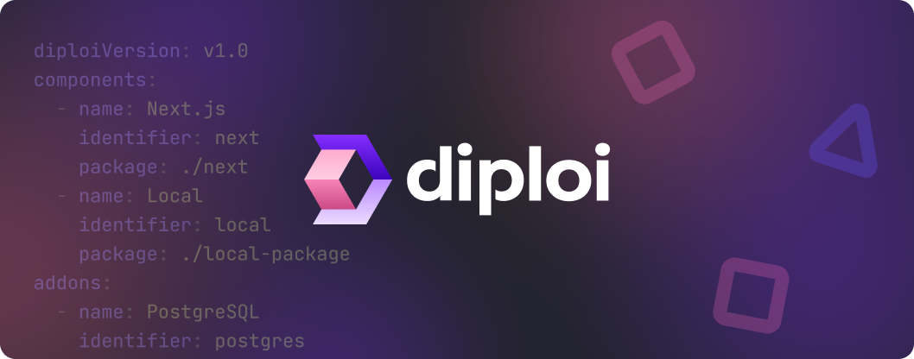
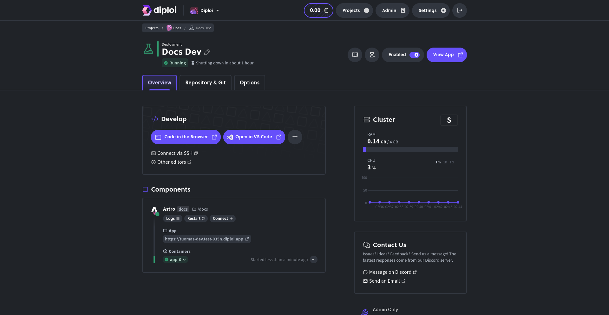
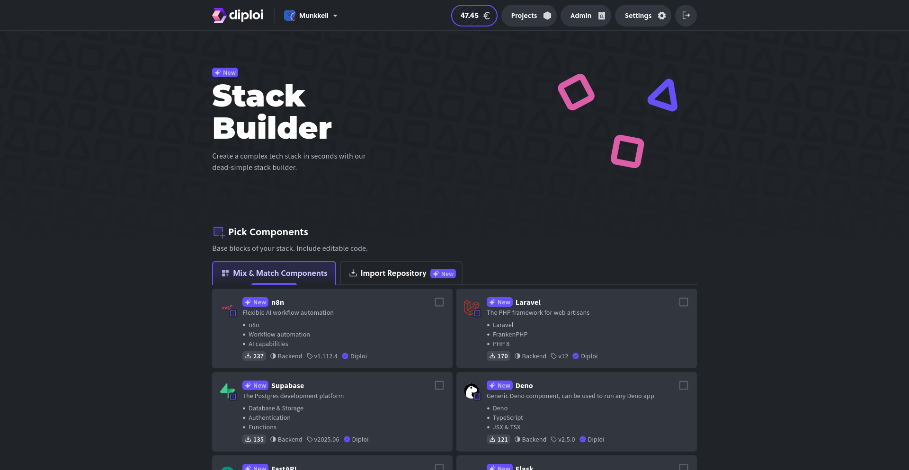
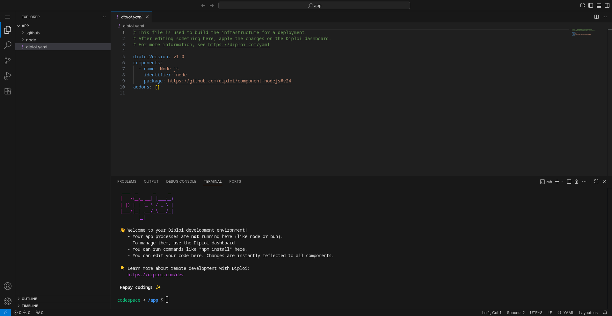

  

    
  

   
  

# Diploi

Diploi is a zero-install development platform that lets you build, test, and deploy apps faster without DevOps overhead.

This repository hosts the code for the website you see at [diploi.com](https://diploi.com/).

If you spot something unclear, outdated, or missing, please open an issue and help us improve.  
You can also report issues related to the Diploi Console.  
Every contribution makes Diploi easier to use for everyone. 💜

<figure style="margin: 0;">
  
  <figcaption>A development environment in Diploi</figcaption>
</figure>

### Links to our sites

- [Website ↗](https://diploi.com/)
- [Documentation ↗](https://docs.diploi.com/)
- [Discord ↗](https://discord.gg/vvgQxVjC8G)
- [Blog ↗](https://dev.to/diploi)

<h2>
  <picture>
    <source media="(prefers-color-scheme: dark)" srcset="./public/github/code-w.svg">
    
  </picture>
  Diploi for Developers
</h2>

Diploi lets you build, test, and deploy apps without setup. Start coding in seconds with remote environments, full GitHub integration, and support for any stack with our [Stack Builder](https://diploi.com/#StackBuilder) and [IaC](https://diploi.com/yaml) implementation.

<figure style="margin: 0;">
  
  <figcaption>The Diploi <a href="https://diploi.com/#StackBuilder">Stack Builder</a></figcaption>
</figure>

### Zero-Install environments

Start coding instantly with environments that run in the cloud. No local setup, no dependencies, no DevOps.

- 🔌 Zero-install remote development
- 🧰 [Stack Builder](https://diploi.com/#StackBuilder) for scaffolding apps
- 📄 Infrastructure as code

### Local IDE support

Diploi works with any IDE that supports SSH. We offer first-class support for the most popular AI-native editors, like Cursor and Zed.

- [Remote development with Diploi ↗](https://docs.diploi.com/building/remote-development)

### Support For Any Stack

Build your stack your way. Diploi supports any combination of services, from Lovable apps to databases, APIs, and more.

- [Stack Builder ↗](https://diploi.com/#StackBuilder)
- [Import a Lovable app ↗](https://diploi.com/lovable)

<h2>
  <picture>
    <source media="(prefers-color-scheme: dark)" srcset="./public/github/users-three-w.svg">
    
  </picture>
  Diploi for Teams
</h2>

Diploi makes teamwork seamless. Every developer gets their own environment with one-click setup and instant sharing. Teams can code together, review faster, and ship with confidence, all without DevOps overhead.

<figure style="margin: 0;">
  
  <figcaption>The Diploi Browser IDE</figcaption>
</figure>

### Individual Environments

Your own environment. Your own IDE. Connect to others whenever you need to.

- 🔌 Zero-install remote development
- 🖱️ One-click environment setup
- ⏩ 30 second developer onboarding

### GitHub Workflow

Git that works the way you do. Pull requests, Actions, or plain CLI.

- 🤝 GitHub integration
- 🪄 Automatic Git, CI/CD, SSL
- 📄 Infrastructure as code

### Easy Previews

Want to demo a feature? Share the link. You can spin up endless environments.

- 🔗 Shareable environment URLs
- 🖱️ One-click environment cloning
- 🪵 Real-time logging
