Updated <time datetime="2025-09-22T01:00:05.000Z">September 22, 2025</time>

###### Ship new Deno apps using Diploi with zero server configuration

Deno is runtime, created to be the successor to Node.js, even created by the creator of Node!. It comes with native TypeScript support, and meant for building web servers and backend applications.

In this guide, you’ll learn how to launch a vanilla Deno application on Diploi and get it live online in seconds. You won’t have to handle YAML configs or setup servers manually, Diploi handles all that for you.

We’ll walk through everything from creating your Deno project on Diploi, to pushing it to production, and even setting up a custom domain.

Let’s go!

    <iframe width="560" height="315" src="https://www.youtube.com/embed/mNJpQ-_r9rs?si=5eSJB8LBJaiIHyJ5" title="Launching a Deno app using Diploi" frameborder="0" allow="accelerometer; autoplay; clipboard-write; encrypted-media; gyroscope; picture-in-picture; web-share" referrerpolicy="strict-origin-when-cross-origin" allowfullscreen></iframe>

---

## Table of contents

- [Getting started with Deno on Diploi](#getting-started-with-deno-on-diploi)
- [Launching your Deno app to Production](#launching-your-deno-app-to-production)
- [Configuring a custom domain for your Deno app](#configuring-a-custom-domain-for-your-deno-app)
- [Trying out Deno for the first time?](#trying-out-deno-for-the-first-time)
- [References](#references)

---

## Getting started with Deno on Diploi

### What you need

To follow along, make sure you have:

- A GitHub account.
- A Diploi account.

That's pretty much it. If you don't have Diploi account, you can create one for free, no payment method required.

### How to create an app with Deno

Once you have sign-in, follow these steps:

- Create a new project, by clicking the "Create Project +" button on your Dashboard.
  

- Pick Deno as the component: Under Pick Components, choose the Deno option. (Diploi might list Deno as a runtime or framework option.) If you want to go full-stack, you can add another component here too, for example, you could combine a Deno backend API with a React front-end in a single project.
  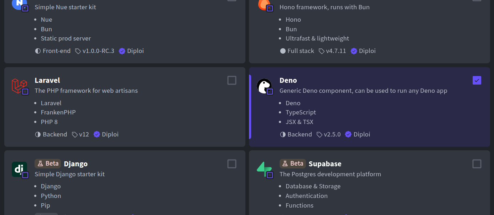

- Select any add-ons (optional): In Pick Add-ons, you can attach databases or other services if your app needs them (like PostgreSQL, Redis, etc.), or you can skip this for now.
  

- Create a repository: Choose Create Repository so Diploi will generate a new GitHub repository for your project’s code. Give your project a name and confirm the creation, Diploi will set up the repo with a basic Deno starter for you.
  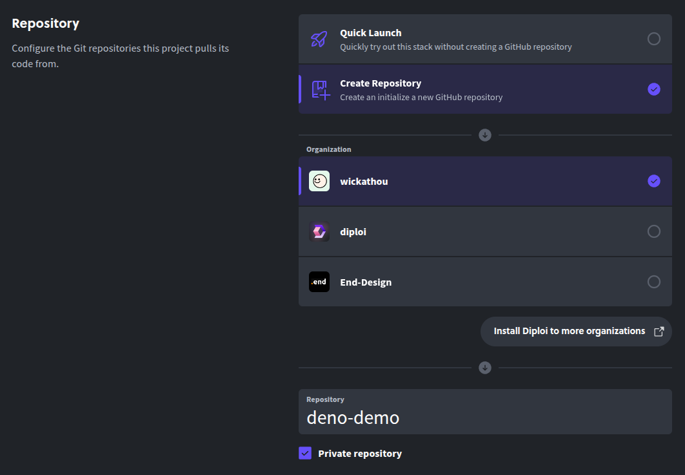

- Launch the stack: Finally, click Launch Stack. Diploi will now provision your new Deno app environment.
  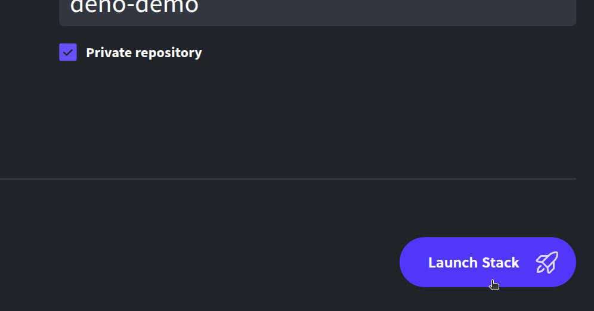

And that should be it, in a few moments, you’ll have a fresh Deno project running on Diploi.

In the background, Diploi spins up all the necessary infrastructure (containers, runtime, etc.) to run your Deno app on a publicly reachable, SSL-protected URL.

By default, every new project starts in a **Remote Development deployment**, similar to GitHub Codespaces, where you can code right away, without running the app locally.

You have tow options to start developing your new Deno app using this Remote Development environment:

- By opening the browser-based IDE, and edit your code there.
  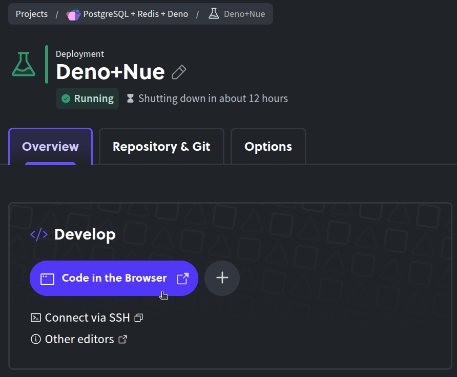

- Or by connecting your local code editor (such as VS Code or Cursor) to the remote environment via SSH. This way you can code remotely as if it were running on your own machine.
  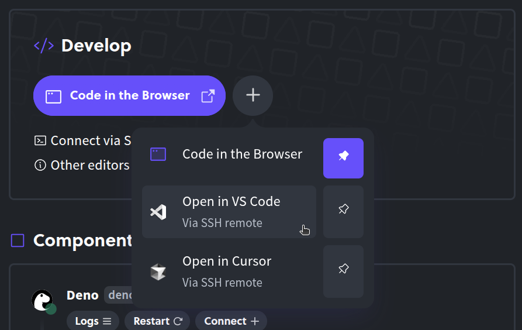

Either way, there’s no need to git clone the repo or run deno install locally, everything is already set up in the cloud environment. Diploi will live-reload or rebuild as needed so you can preview your Deno app’s endpoints instantly.
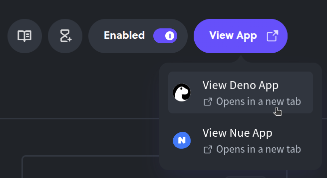

---

## Launching your Deno app to Production

Once you’ve been developing and you’re happy with your Deno application, you can deploy it to a production environment.

- Open your project’s page: In the Diploi console, go to your Deno project’s dashboard. (The URL will look like: https://console.diploi.com/<YOUR_USERNAME>/project/<YOUR_PROJECT_ID>).
  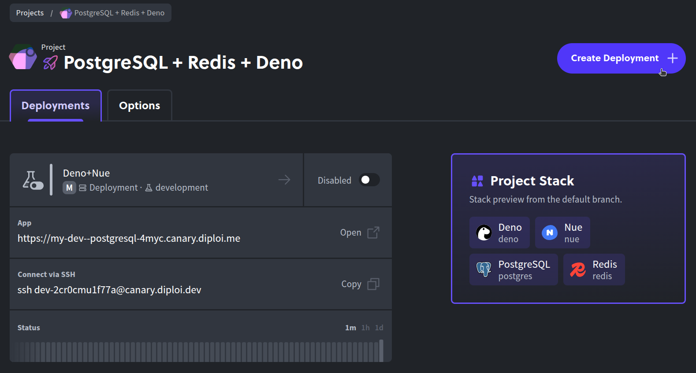

- Create a new deployment: Click the "Create Deployment +" button.

- Choose Production stage: Select Production as the deployment stage when prompted.
  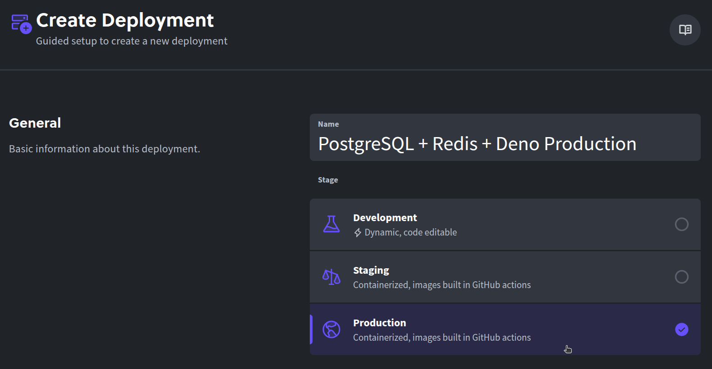

- Select a cluster size: Pick the cluster size or plan that fits your needs (you can start small for testing, and scale up later if needed).
  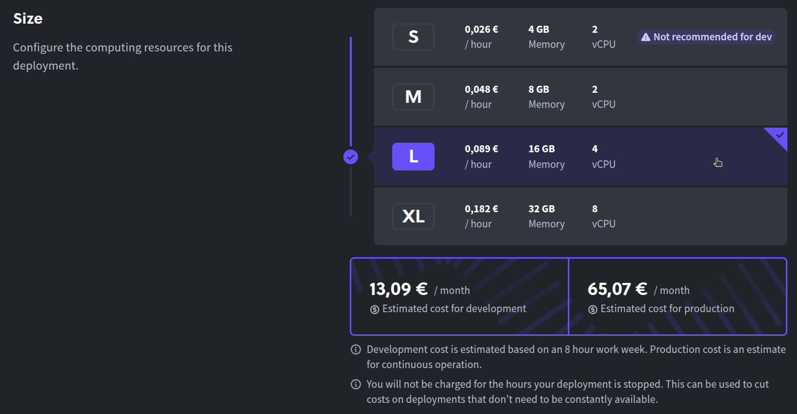

- Pick the source branch: Choose which Git branch to deploy, for example "prod".
  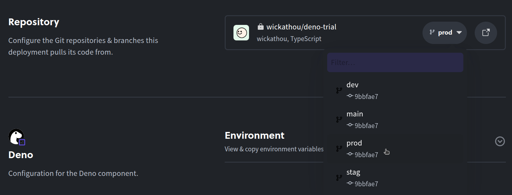

- Set environment variables (if any): Add or adjust any environment variables your Deno app might require in production. For a basic app, you might not need to change anything here.
  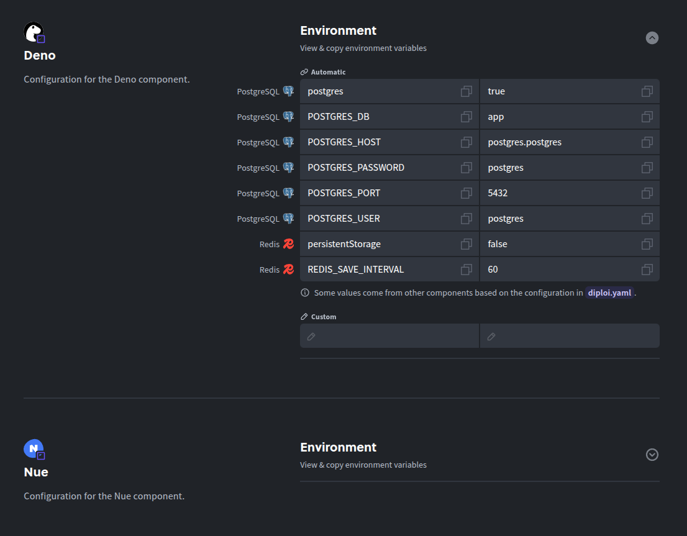

- Launch the deployment: Click Create Deployment to spin up the production instance of your app.
  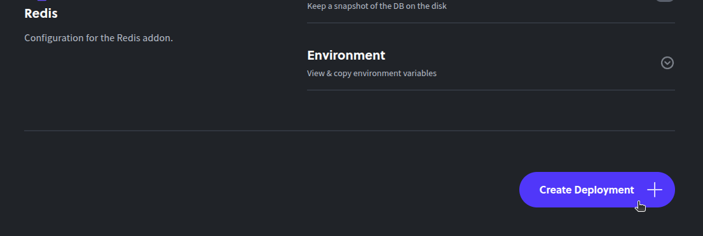

Give Diploi a moment to work its magic. It will build a production-ready version of your Deno application and deploy it.

That’s all it takes, and your Deno app is now live in Production! You should see it running on a public URL (by default, on a Diploi subdomain).

Now let’s customize that URL to use your own domain name.

---

## Configuring a custom domain for your Deno app

By default, Diploi gives your production deployment a random subdomain ending in `.diploi.me` and SSL protection. For example, your app might be accessible at my-app.diploi.me.

While that works out of the box, you’ll probably want to use your own domain for a real project. Here’s how to set that up:

- Open the Options tab: Navigate to the Options settings for your Production deployment. You can find this in your deployment’s dashboard (there’s an “Options” tab), or go directly to the URL: https://console.diploi.com/<YOUR_USERNAME>/project/<YOUR_PROJECT_ID>/deployment/<YOUR_DEPLOYMENT_ID>/options.

- Disable the auto-generated domain: Scroll to the Endpoints section. There, flip the toggle off for Use Auto-Generated Endpoints. This tells Diploi you want to use a custom domain instead of the default `.diploi.me` address.

- Enter your custom domain: Once you disable the auto-endpoint, a field will appear showing the current Diploi subdomain and an option to enter a custom domain. Check the box for Use custom domain, then type in the custom domain you want to use (for example, `yourdomain.com`).
  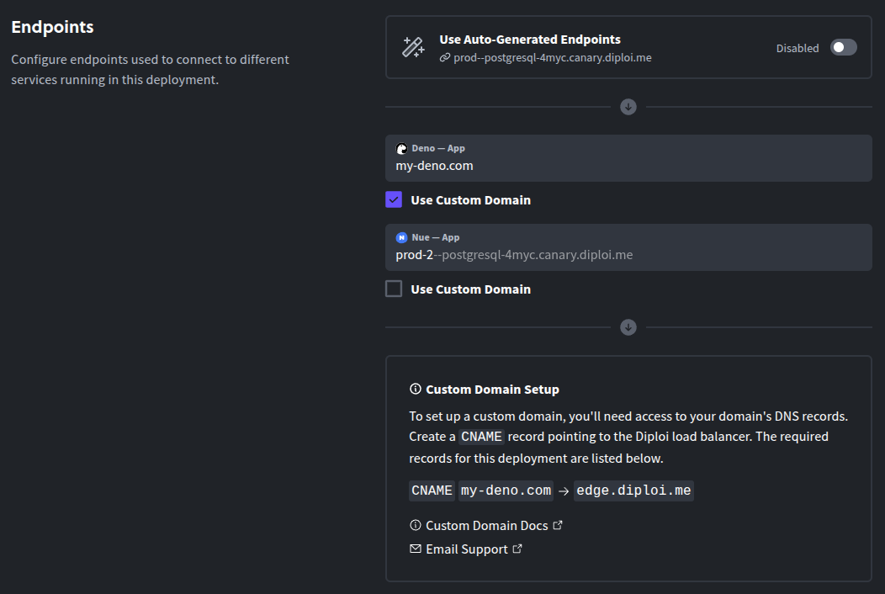

- Save changes: Scroll down and click Save Changes to apply the new domain configuration. Diploi will update your deployment to recognize the custom domain.

- Update your DNS record: Finally, go to your domain provider and create a CNAME record for your chosen domain or subdomain, and point that CNAME record to `edge.diploi.com`.

Your app will now be accessible via the newly setup domain you entered.

The DNS change often propagates quickly, but it can take up to ~30 minutes to work.

---

## Trying out Deno for the first time?

If you are curious about Deno, but not ready to commit to a full project setup? Then you can spin up a temporary Deno instance in Diploi to play around.

Here are two easy ways to try Deno on Diploi:

- Option 1
  - Start a trial without an account: Head to the Diploi StackBuilder <a href="https://diploi.com/#StackBuilder" target="_blank">https://diploi.com/#StackBuilder</a> to launch a free trial project instantly.
    This lets you create a temporal Deno environment. Just select the Deno stack (along with any extras you want) and click Launch, no account or credit card required.
- Option 2
  - Quick Launch with a Diploi account: If you already have a Diploi account and are logged in, you can use the Quick Launch feature. Create a new project as usual, and in the Repository section, choose Quick Launch instead of linking a GitHub repo. This will spin up a Deno project environment for you to experiment with, without creating a permanent repository.
    

Now you know how to go from zero to a deployed Deno app using Diploi, without dealing with servers, build tooling, or DevOps.

---

We hope this guide helps you get your Deno application online faster and easier than ever. If you have any questions or want to share what you’re building, feel free to join our community on Discord and say hello.

---

## References

- Official Deno Documentation https://docs.deno.com/runtime/
- Deno in Diploi http://diploi.com/component/deno
- Diploi Components https://docs.diploi.com/building/components
- Custom Domains https://docs.diploi.com/deploying/custom-domain/
