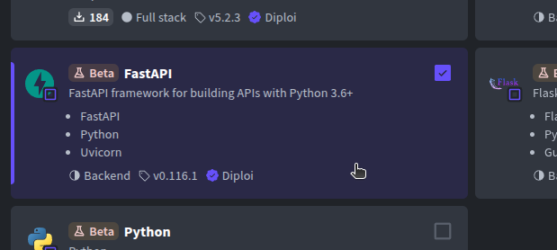
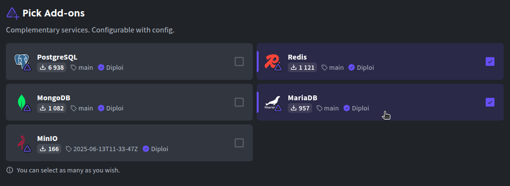
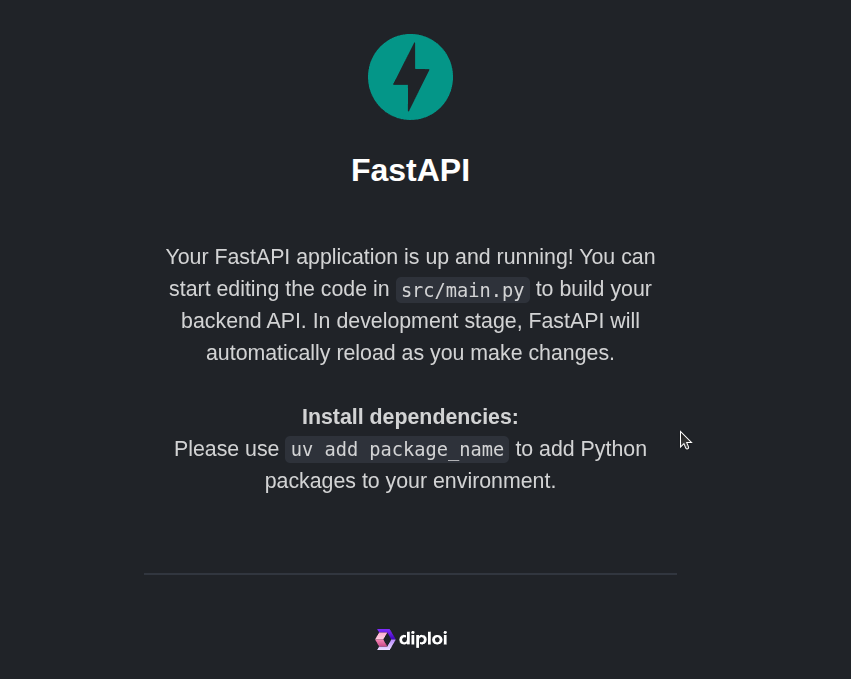
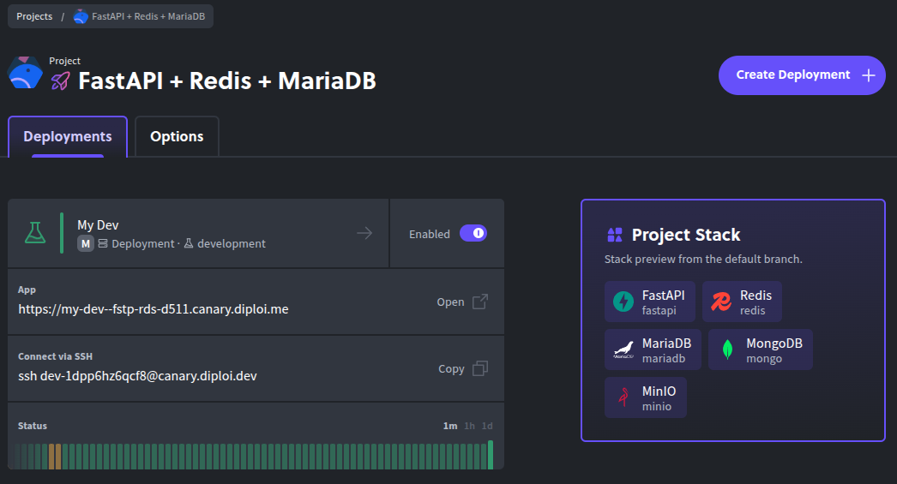
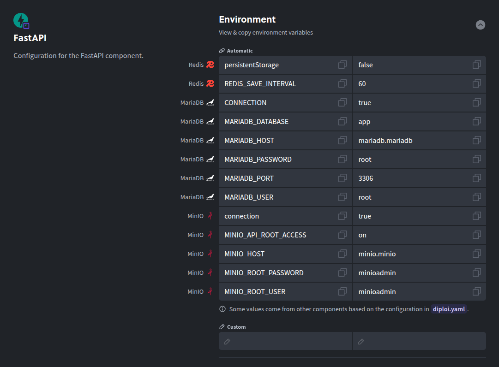

Updated <time datetime="2025-10-28T11:09:05.000Z">October 28, 2025</time>

###### Spin up FastAPI on Diploi with zero server configuration

FastAPI is a high-performance Python framework designed for APIs. It uses type hints, supports async out of the box, and auto-generates OpenAPI docs, which makes it ideal for both prototypes and production services.

In this guide, we’ll start from a simple FastAPI project and have it running on Diploi in minutes. Diploi handles the build, configuration, and runtime for you.

We’ll create your FastAPI project in Diploi, promote it to production, and then connect a custom domain.

Let’s get started.

    <iframe width="560" height="315" src="https://www.youtube.com/embed/zi0ZVOIQTt4?si=DGIhtm7KByKZSyr8" title="Using FastAPI in Diploi" frameborder="0" allow="accelerometer; autoplay; clipboard-write; encrypted-media; gyroscope; picture-in-picture; web-share" referrerpolicy="strict-origin-when-cross-origin" allowfullscreen></iframe>

---

## Table of contents

- [Getting started with FastAPI on Diploi](#getting-started-with-fastapi-on-diploi)
- [Launching your FastAPI app to Production](#launching-fastapi-to-production)
- [Configuring a custom domain for your FastAPI app](#using-a-custom-domain-with-your-fastapi-app)
- [Trying out FastAPI for the first time?](#just-exploring-fastapi)
- [References](#references)

---

## Getting started with FastAPI on Diploi

### What you need

To follow along, you’ll need:

- A GitHub account
- A Diploi account

You can create a Diploi account for free, no credit card required.

### How to create a FastAPI app

Now, to get started, you'll need to create a Project using FastAPI, this is how:

- Create a new project: Once you sign-in, you should land in the Project creation page, but in case this is not your first time using Diploi, access your Dashboard and click the **Create Project +** button.
  

- Choose the FastAPI component: In **Pick Components**, select **FastAPI** (you may find it under Python/FastAPI). If you want a full-stack setup, add a frontend too, e.g., pair a FastAPI backend with a React UI in the same project.
  

- Add optional services: In **Pick Add-ons**, attach databases or caches if needed (PostgreSQL, Redis, etc.). You can skip this now and add them later by editing the `diploi.yaml` at the project root.
  

- Create a repository: Choose **Create Repository**, so Diploi can scaffold a new GitHub repo for your app.
  

- Launch the stack: Click **Launch Stack**, and Diploi will provision the environment and boot your FastAPI app.  
  

By launching your stack, Diploi will setup your app's folder structure as a monorepository, which will be accessible online with a public URL, and it will also start a **Remote Development** environment, so you can start coding without the need of cloning the repository locally.

You can access the Remote Development environment via:

- The browser IDE,
  

- Or your local editor by connecting by SSH.  
  

You can still develop locally if you prefer to run your application in your own environment, so you are not constrained to the Remote Development environment to create your application.

---

## Launching FastAPI to Production

When your FastAPI application is ready to go live in a production environment, follow these steps:

- Push your changes to GitHub: We recommend separate branches per stage of your app (e.g., Git Flow).

- Open your project dashboard: In the Diploi console, navigate to your FastAPI project’s page.
  
- Create a new deployment: Click **Create Deployment +** and choose **Production** for the stage.  
  

- Choose a cluster size: Select the resources that match your needs. We recommend that you start small, and scale later.  
  

- Select the source branch: Pick the Git branch to deploy (e.g., `main` or `prod`).  
  

- Configure environment variables: Add any variables that your API will need in production.
  

- Launch the deployment: Click **Create Deployment** to start up the production deployment.  
  

Diploi will build and deploy a production-ready environment. Now, let’s add a custom domain.

---

## Using a custom domain with your FastAPI app

As you might have noticed, Diploi gives your deployments a random `.diploi.me` subdomain. For example, your service might be reachable at `my-app.diploi.me`.

To use your own domain:

- Open the Options tab: In your Production deployment, go to the **Options** tab from the deployment dashboard.  
  

- Turn off generated endpoints: In **Endpoints**, disable **Use Auto-Generated Endpoints** to reveal the custom domain settings.

- Add your hostname: Enable **Use Custom Domain** and enter the domain you will use, for example `api.yourdomain.com` or `yourdomain.com`.  
  

- Save the configuration: Scroll to the bottom and click **Save Changes**.

- Configure your domain's DNS settings: From your domain provider, you must create a new DNS **CNAME** record for the hostname you chose and point it to `edge.diploi.com`.

Once you modify your DNS settings, the update can take up to 30 minutes to propagate, but usually it is nearly instant.

Your FastAPI application will be available at your custom domain and SSL-protected automatically.

---

## Just exploring FastAPI?

You can try FastAPI on Diploi in seconds without even registering an account. Here are two quick options to launch a playground to test-drive FastAPI:

- Option 1 - Launch a trial without signing up
  Open the Diploi StackBuilder <a href="https://diploi.com/#StackBuilder" target="_blank">https://diploi.com/#StackBuilder</a> and start a free trial project. Pick the **FastAPI** stack and click **Launch**. No account or credit card required and you get a temporary environment to explore.

- Option 2 - Quick Launch with your Diploi account
  If you are logged in, create a new project and in the **Repository** section, choose **Quick Launch** instead of creating a GitHub repository. Diploi provisions a ready-to-use FastAPI app so you can experiment immediately.  
   

These options are great for testing and learning. For production, create a full project and repository. Remember FastAPI exposes interactive docs at `/docs` out of the box.

---

And that's it! Now you should have a fresh deployment with FastAPI running. If you have questions, reach out on Discord or via email by messaging us at hello@diploi.com

Happy coding 👩‍💻

---

## References

- Official FastAPI Documentation https://fastapi.tiangolo.com/
- FastAPI in Diploi https://diploi.com/component/fastapi
- Diploi Components https://docs.diploi.com/building/components
- Custom Domains https://docs.diploi.com/deploying/custom-domain/
