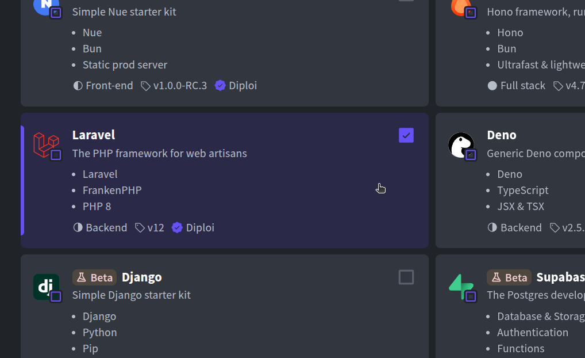

Updated <time datetime="2025-10-28T11:12:05.000Z">October 28, 2025</time>

###### Getting started with Laravel, but in easy-mode

If you are part of the PHP world, you must have heard of Laravel. A very flexible framework to build web applications with PHP, very popular around the world.

You probably know how to start a new Laravel app running `composer create-project laravel/laravel`, that's not a problem really. What it is a problem, is getting your new Laravel app online, with CI/CD and SSL-protected.

In this guide, we’ll show you how to get your new Laravel app not only setup while skipping the local install, but also get it online in record time by using Diploi, all without setting up servers or manipulating YAML files.

    <iframe width="560" height="315" src="https://www.youtube.com/embed/A9SRN3mq0EY?si=neZQyfphSPVTVrO2" title="Launching a Laravel app with Diploi" frameborder="0" allow="accelerometer; autoplay; clipboard-write; encrypted-media; gyroscope; picture-in-picture; web-share" referrerpolicy="strict-origin-when-cross-origin" allowfullscreen></iframe>

---

## Table of contents

- [What you need](#what-you-need)
- [How to create an app with Laravel](#how-to-create-an-app-with-laravel)
- [Launching your Laravel app to Production](#launching-your-laravel-app-to-production)
- [Configuring a custom domain for your Laravel app in Production](#configuring-a-custom-domain-for-your-laravel-app-in-production)
- [Trying out Laravel for the first time?](#trying-out-laravel-for-the-first-time)
- [References](#references)

---

## What you need

- A GitHub account
- A Diploi account

If you have that, you are ready.

---

## How to create an app with Laravel

1.  In the Diploi Dashboard, click **Create Project +**.
2.  Under **Pick Components**, choose **Laravel**. You can add other frameworks on this page too, if you want to create a multi-component app, for example, a Laravel backend with a React frontend.
    
3.  In **Pick Add-ons**, select any databases or extra services your app needs (for example, add a MariaDB or PostgreSQL database if your Laravel app will use one).
    
4.  In the **Repository** section, choose **Create Repository** to have Diploi generate a new GitHub repository for your project.
5.  Finally, click **Launch Stack**.

This process will create a new Project with Laravel, and every new project on Diploi launches with a **Remote Development** deployment.

This Remote Development envrironment allows you to start coding without having to run anything locally. Diploi provides a browser-based IDE so you can code directly in your browser, or you can connect your local IDE to the remote dev environment via SSH.

Under the hood, Diploi uses Kubernetes to provision the infrastructure for your app within a single cluster, so you don't need to manage services individually.

---

## Launching your Laravel app to Production

When you’re ready to take your Laravel app live in front of real users, you can easily launch a Production deployment on Diploi by following these steps:

1. Open your Laravel project’s dashboard at Diploi, the URL will look like `https://console.diploi.com/<YOUR_USERNAME>/project/<YOUR_PROJECT_ID>`.
2. Click **Create Deployment +**.
3. Select **Production** as the deployment stage.
4. Choose the cluster size for your Production deployment, depending on your needs.
5. Select the source branch you want to deploy (for example, `prod`).
6. Set any environment variables your app needs for production (e.g. database credentials, Laravel environment settings, etc.).
7. Click **Create Deployment +**.

This will spin up a new **Production** deployment for your Laravel app, fully configured and ready to serve your users.

---

## Configuring a custom domain for your Laravel app in Production

By default, your app will be live at a `{your-app}.diploi.me` URL (and you can customize the subdomain). But, you might want to use your own domain name for your production site. To set up a custom domain for your Laravel app:

1. Go to the **Options** tab of your Production deployment’s dashboard, you can also navigate directly to the Options URL:
   `https://console.diploi.com/<YOUR_USERNAME>/project/<YOUR_PROJECT_ID>/deployment/<YOUR_DEPLOYMENT_ID>/options`.
2. Scroll down to the **Endpoints** section and disable the **Use Auto-Generated Endpoints** option.
3. Once you toggle that off, a field will appear showing your current Diploi subdomain, along with a checkbox to **Use custom domain**. Check that box, then enter the custom domain name you want to use for your app (e.g. `myawesomeapp.com`).
4. Click **Save Changes**.
5. Now, go to your DNS provider’s settings for your domain and create a **CNAME record** pointing your chosen domain (or subdomain) to `edge.diploi.com`.

That’s it! The custom domain changes usually take effect instantly, but it can take up to 30 minutes for DNS changes and SSL certificate provisioning to propagate fully.

Once it’s done, your Laravel app will be accessible at your own domain with HTTPS.

---

## Trying out Laravel for the first time?

If you’re new to Laravel or just want to see it in action without setting up anything locally, Diploi gives you a couple of easy ways to test-drive Laravel in the cloud:

- **Starting a trial without registering an account**
  Go to our homepage [https://diploi.com/#stackbuilder](https://diploi.com/#stackbuilder) and the choose Laravel plus any other components you would like to try out. You can also visit [https://diploi.com/component/laravel](https://diploi.com/component/laravel)

- **Starting a Quick Launch with an account**
  If you already have a Diploi account, you can create a new project and, in the **Repository** section, select **Quick Launch**. This will give you a temporary development environment to play with Laravel, without connecting to any Git repository.

Now you know the easiest way to go from “Hello World” to a production-ready Laravel app, all without any DevOps.

---

What other frameworks or services would you like to see supported on Diploi? Join our [Discord](https://discord.com/invite/vvgQxVjC8G) and let us know, We would love to hear from you.

---

## References

- Official Laravel Documentation https://laravel.com/docs/12.x
- Laravel in Diploi https://diploi.com/component/laravel
- Diploi Components https://docs.diploi.com/building/components
- Custom Domains https://docs.diploi.com/deploying/custom-domain/
