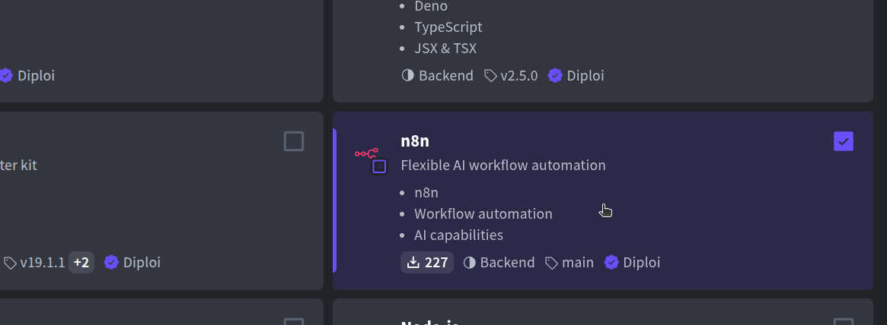
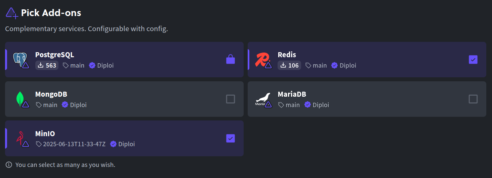
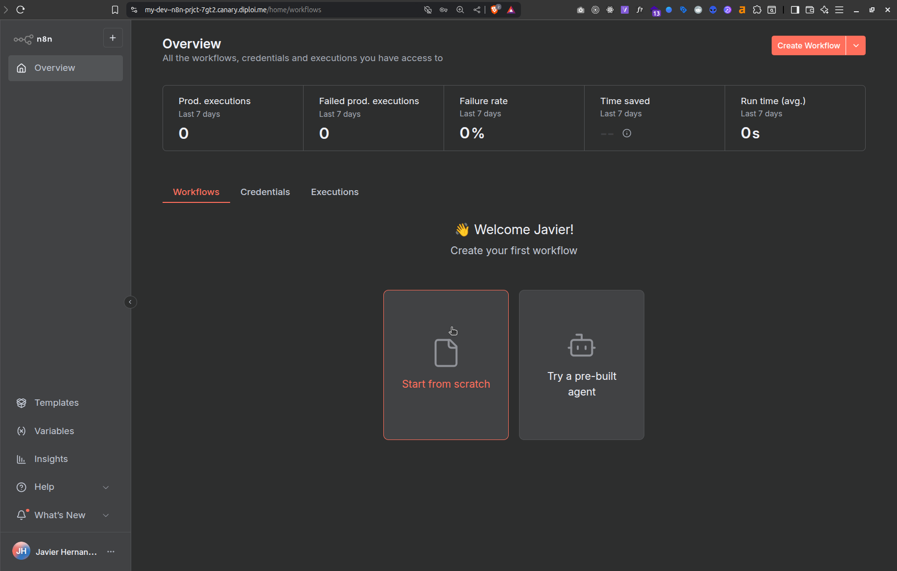
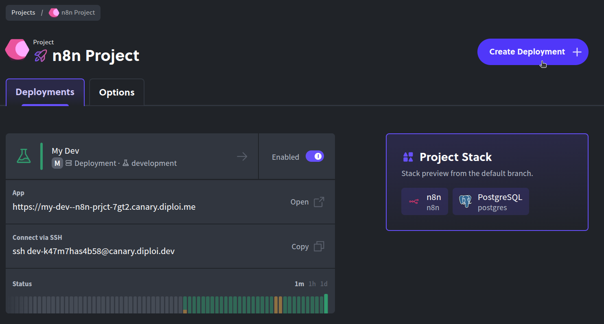
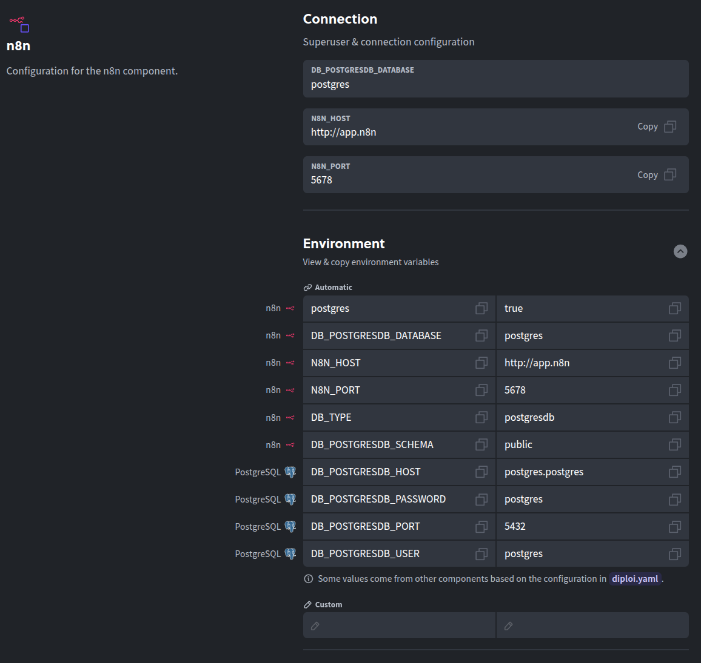

Updated <time datetime="2025-10-28T11:13:05.000Z">October 28, 2025</time>

###### Spin up n8n on Diploi with zero server configuration

n8n is an open-source workflow automation tool with a visual editor and lots of integrations. In this guide, we’ll create an instance of n8n and get it running on Diploi in minutes. Diploi handles the build, configuration, and runtime, so you can focus on your automations, and not managing infrastructure.

    <iframe width="560" height="315" src="https://www.youtube.com/embed/O2CWyulCVNM?si=KgK81KMdqUocqoJC" title="Launching n8n on Diploi" frameborder="0" allow="accelerometer; autoplay; clipboard-write; encrypted-media; gyroscope; picture-in-picture; web-share" referrerpolicy="strict-origin-when-cross-origin" allowfullscreen></iframe>

---

## Table of contents

- [Getting started with n8n on Diploi](#getting-started-with-n8n-on-diploi)
- [Launching your n8n app to Production](#launching-your-custom-nodes-for-n8n-to-production)
- [Configuring a custom domain for your n8n app](#configuring-a-custom-domain-for-your-n8n-app)
- [New to n8n? Try it in the cloud first for free](#new-to-n8n-try-it-in-the-cloud-first-for-free)
- [References](#references)

---

## Getting started with n8n on Diploi

### What you need

- A GitHub account
- A Diploi account

You can create a Diploi account for free, no credit card required.

### How to get n8n hosted online

After signing in:

- **Create a new project:** Click **Create Project +** on your Dashboard.
  

- **Pick the n8n component:** In **Pick Components**, select **n8n** (look under Automation/Tools). Want a bundle? Add more components (e.g., a frontend) and run them together.
  

- **Optional add-ons:** By default, n8n will launch with PostgreSQL, but you can attach other databases or caches if needed.
  

- **Create a repository:** Choose **Create Repository** so Diploi scaffolds a new GitHub repo for your app.  
  

- **Launch the stack:** Click **Launch Stack**. Diploi provisions your environment and starts n8n.  
  

Once you are done and your environment finishes loading, you'll be able to access your n8n instance.

Diploi sets up a **Remote Development** environment with a public preview URL, so you can start right away, without requiring a local setup. Which you can use via:

- **Browser IDE**: Edit files online with a full VS Code-style experience.  
  

- **Your local editor via SSH**: Connect VS Code, Cursor, or any SSH-friendly IDE to the remote dev container.  
  

This is ideal if you want to create your own custom nodes. For more about custom nodes, check the official guide from the n8n team:
https://docs.n8n.io/integrations/creating-nodes/build/

---

## Launching your custom nodes for n8n to Production

When you’re ready to go live with custom nodes:

- **Push changes to GitHub.**

- **Open your project dashboard:** Go to your n8n project in the Diploi console.
  

- **Create a Production deployment:** Click **Create Deployment +** and choose **Production**.  
  

- **Pick a cluster size:** Start small; scale when needed.  
  

- **Select the source branch:** Typically `main` or `prod`.  
  

- **Configure environment variables:** Add any secrets and settings your instance needs (e.g., encryption key, OAuth credentials).
  

- **Create Deployment:** Diploi builds and launches your production instance.  
  

Open the deployment URL to complete n8n’s first-run setup and create your admin account and that's it, your n8n deployment is live!

---

## Configuring a custom domain for your n8n app

By default, production runs on a `.diploi.me` subdomain (e.g., `my-automation.diploi.me`). To use your own domain:

- **Open the Options tab:** In your Production deployment, go to **Options**.  
  

- **Disable auto-generated endpoints:** Toggle off **Use Auto-Generated Endpoints**.

- **Add your hostname:** Enable **Use Custom Domain** and enter something like `n8n.yourdomain.com`.  
  

- **Save changes**, then update DNS: Create a **CNAME** for your hostname pointing to **edge.diploi.com**.

DNS/SSL usually settle quickly, but allow up to ~30 minutes. After that, your n8n instance will be live at your custom domain with HTTPS handled automatically.

---

## New to n8n? Try it in the cloud first for free

You can explore n8n on Diploi in seconds without a local setup:

- **Option 1 Trial without sign-up**  
  Open the **StackBuilder** at <a href="https://diploi.com/#StackBuilder" target="_blank">https://diploi.com/#StackBuilder</a>, pick **n8n**, and click **Launch**. You’ll get a temporary environment to play with, no account or credit card required.

- **Option 2 Quick Launch (if you’re logged in)**  
  Create a new project and in **Repository**, choose **Quick Launch**. Diploi provisions a ready-to-use n8n app instantly.  
  

These are perfect for testing. For production, create a full project with a GitHub repository so your changes are tracked.

---

That’s it! You’ve got n8n running on Diploi, from dev to production, with a custom domain. If you have questions or want to share what you’re building, share with us in Discord or via email at hello@diploi.com.

Happy automating 🤖

---

## References

- Official n8n Documentation https://docs.n8n.io/
- Diploi's implementation for n8n https://github.com/diploi/component-n8n
- Trial launch page for n8n https://diploi.com/component/n8n
- Diploi Components https://docs.diploi.com/building/components
- Custom Domains https://docs.diploi.com/deploying/custom-domain/
