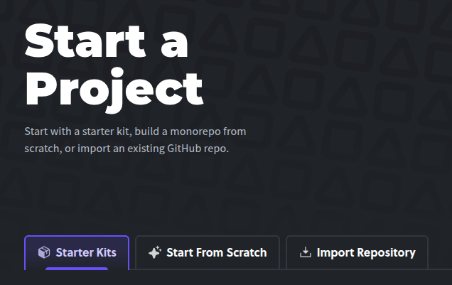
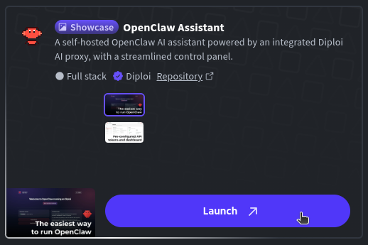
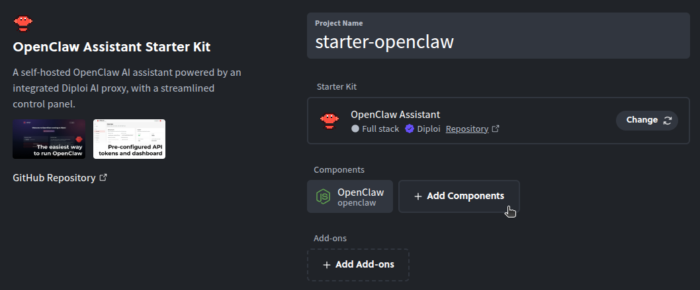
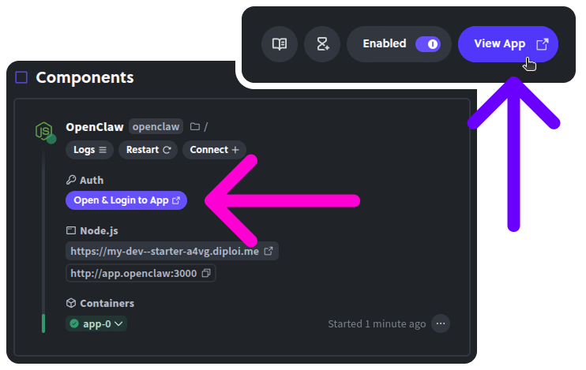
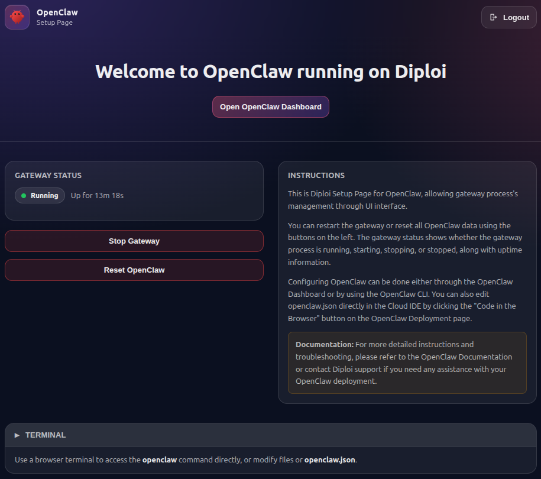
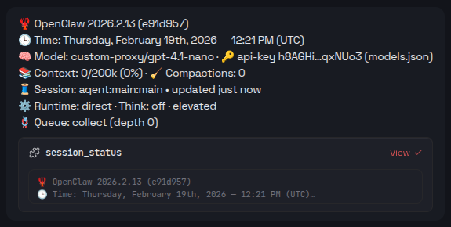
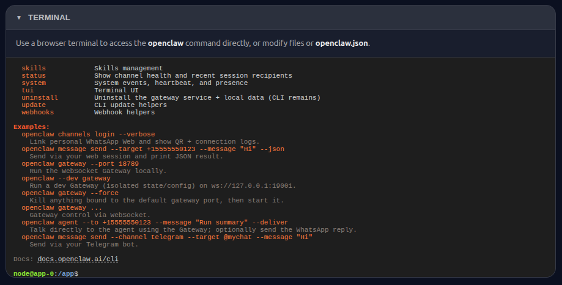
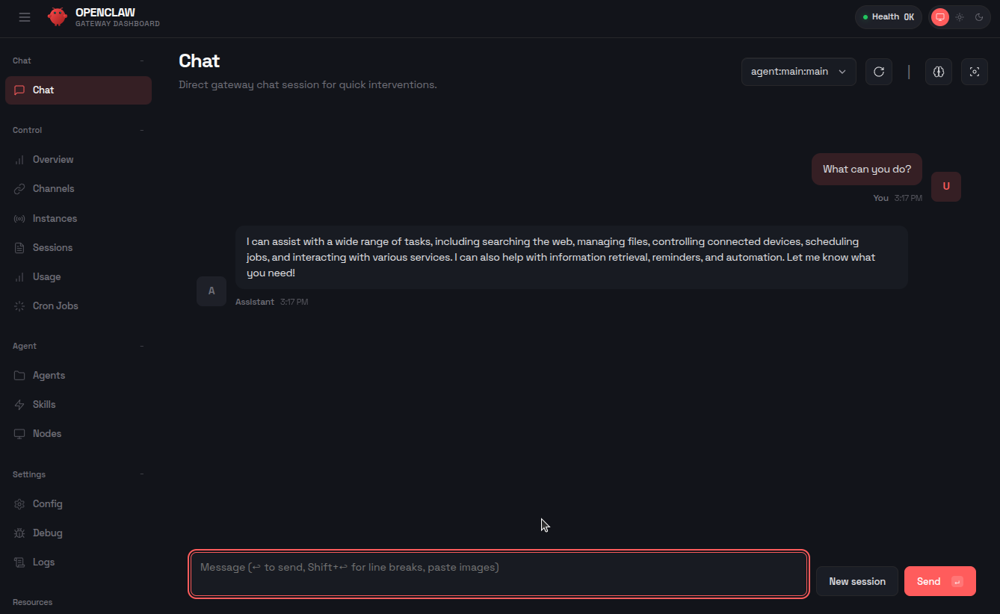
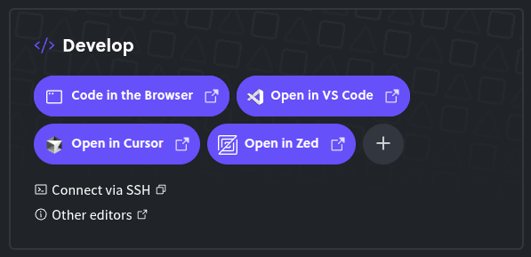
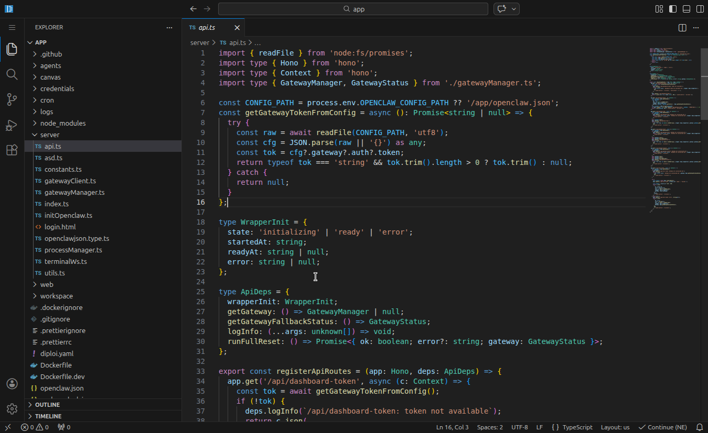

Updated <time datetime="2026-02-20T15:00:00.000Z">February 20, 2026</time>

---

###### Running your own AI assistant without touching any server config

OpenClaw is a popular open-source, self-hosted gateway that connects apps to AI coding agents through a simple interface. It's popular, but setting it up can be a bit tricky.

At Diploi, we're big fans of OpenClaw, and we set out to make it the easiest OpenClaw setup available anywhere. We think we pulled it off 😌

A major challenge with OpenClaw is security. When you run it on Diploi, you don’t have to host it on your main laptop or home server. That gives you a safer, more isolated environment. Still, make sure you only connect it to services you’re comfortable letting AI interact with.

OpenClaw famously tells the AI: _“Don’t ask for permission. Just do it!”_ and that’s both what makes it great and what makes it risky. Still, people love it.

In this guide, we'll deploy OpenClaw on Diploi using our official Starter Kit, and it's all done in less than one minute!

---

## Table of contents

- [Getting started with OpenClaw on Diploi](#getting-started-with-openclaw-on-diploi)
- [Launching your OpenClaw instance to Production](#launching-your-openclaw-instance-to-production)
- [Configuring a custom domain for your OpenClaw gateway](#configuring-a-custom-domain-for-your-openclaw-gateway)
- [References](#references)

---

## Getting started with OpenClaw on Diploi

### What you need

- A GitHub account
- A Diploi account

You can create a Diploi account for free using your GitHub account, no credit card required to start a trial.

### Launching OpenClaw on Diploi

To create a project with a repository, first you need to register for an account. Once you are logged in Diploi, follow these steps:

- **Create a new project:** From the dashboard, click on **Create Project +**.

  

- **Switch to Starter Kits:** From the project creation wizard, switch to **Starter Kits**.

  

- **Select OpenClaw Assistant:** Which bundles the wrapper server and the control UI together, plus it adds a Browser Terminal to the control UI, so you can run advanced commands from your browser.

  

- **Optional, attach additional components and add-ons:** OpenClaw works standalone, but you can add more services to work along, like FastAPI, PostgreSQL, Bun, Next.js, or any other components and add-ons supported on Diploi.

  

- **Create a repository:** Choose **Create Repository** to scaffold a new GitHub repo for your instance.

  

- **Launch the stack:** Click **Launch Stack** and that's it! You will get a development environment with OpenClaw and ready to use 🙂‍↕️

  

Once the environment finishes loading, you'll have access to your OpenClaw control UI. To open the control UI, click on "Open & Login to App" or "View App" at the top of the deployment dashboard.

### Using OpenClaw on Diploi

When you open the Control UI, you will see a welcome page, from which you can access the OpenClaw dashboard, stop or restart the OpenClaw gateway, and access the on-browser terminal.

#### AI Model Fully Setup

All OpenClaw instances hosted on Diploi come with an AI model configured out of the box, so you can start interacting with your agent instantly.

It uses OpenAI's gpt-4.1-nano, through Diploi's custom AI proxy, and you can also add additional models using your own API keys.

#### On-Browser Terminal Access

We added a custom cloud terminal, so you can access the OpenClaw CLI and run commands without having to access the deployment's machine using SSH.

#### Configuring OpenClaw

To access the OpenClaw dashboard, just click "Open OpenClaw Dashboard" from the welcome page. The dashboard is the main point of control for OpenClaw, and it's where you can review the overall state of your agents, manage their skills, and configure additional AI models.

For more information about how to configure your OpenClaw instance, visit their official documentation at https://docs.openclaw.ai/

### Developing Custom Features for OpenClaw

When you start a new project on Diploi, the first environment you get is a **Remote Development** environment with a public preview URL. You can use it via **Browser IDE** or by accessing remotely with **your local editor via SSH**.

This way, you can customize OpenClaw's config beyond what's possible using the CLI or the dashboard.

---

And we are set! By now, you've got OpenClaw running on Diploi, starting from a live development environment to production, and with the option to add a custom domain.

If you run into issues or want to share ideas to improve Diploi, please reach out on [Discord](https://discord.com/invite/vvgQxVjC8G) or email us at hello@diploi.com.

Enjoy the claws! 🦞

---

## References

- Official OpenClaw Documentation https://docs.openclaw.ai/
- OpenClaw Starter Kit on Diploi https://diploi.com/starter-kit/openclaw
- OpenClaw GitHub Repository https://github.com/diploi/starter-openclaw
- Custom Domains on Diploi https://docs.diploi.com/deploying/custom-domain/

---