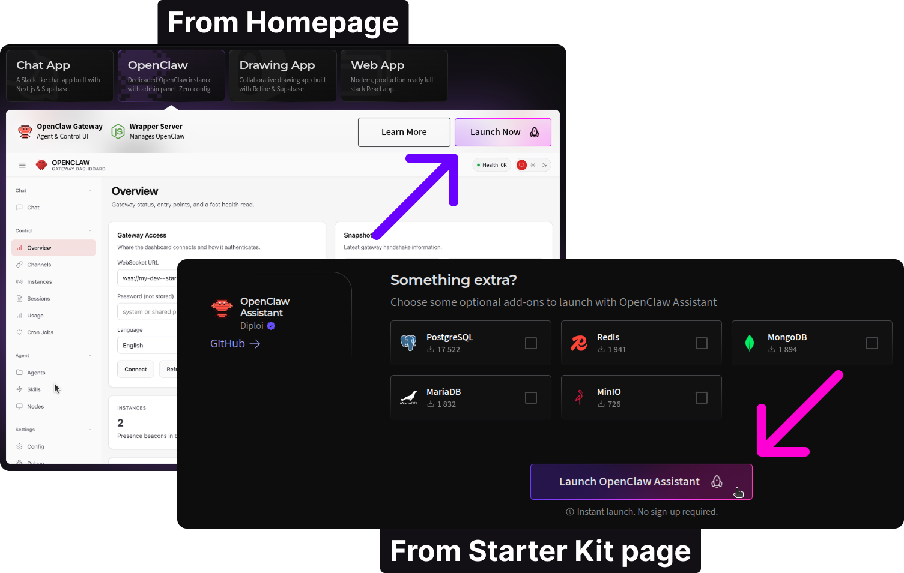
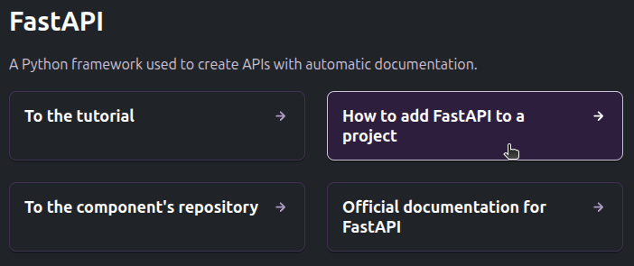
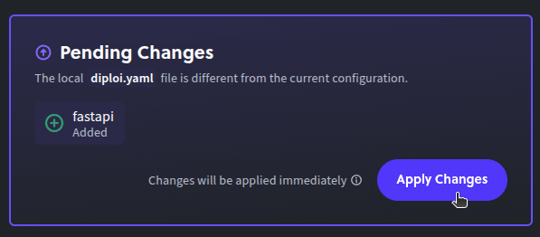
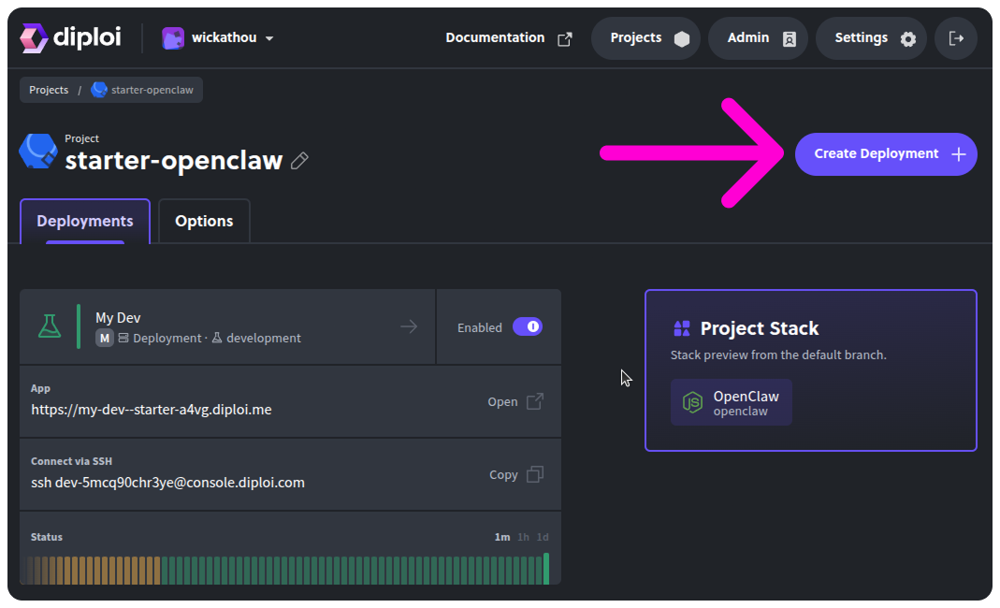
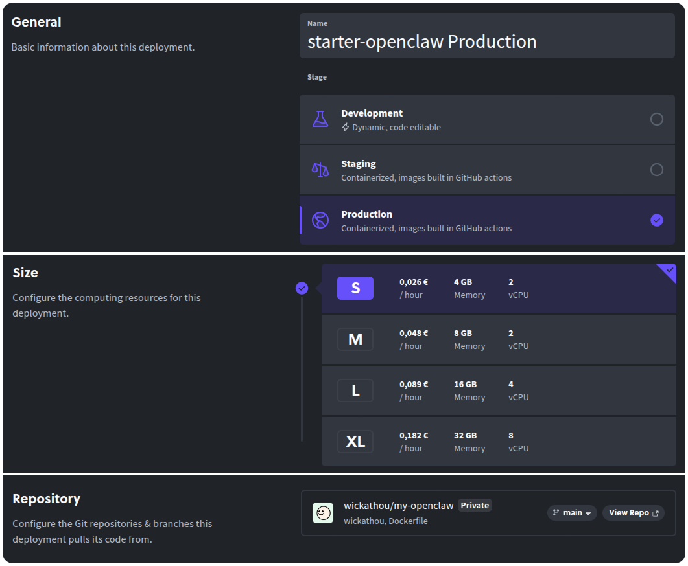
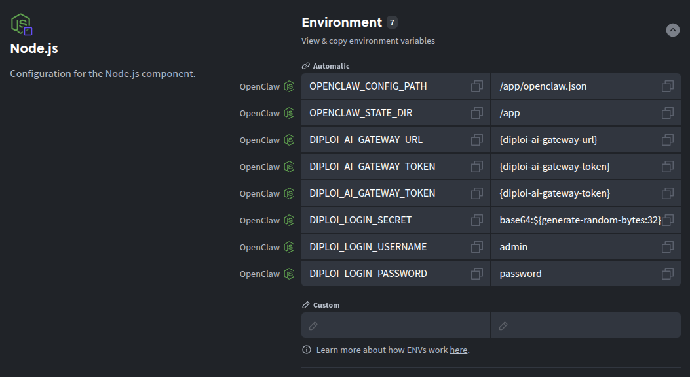
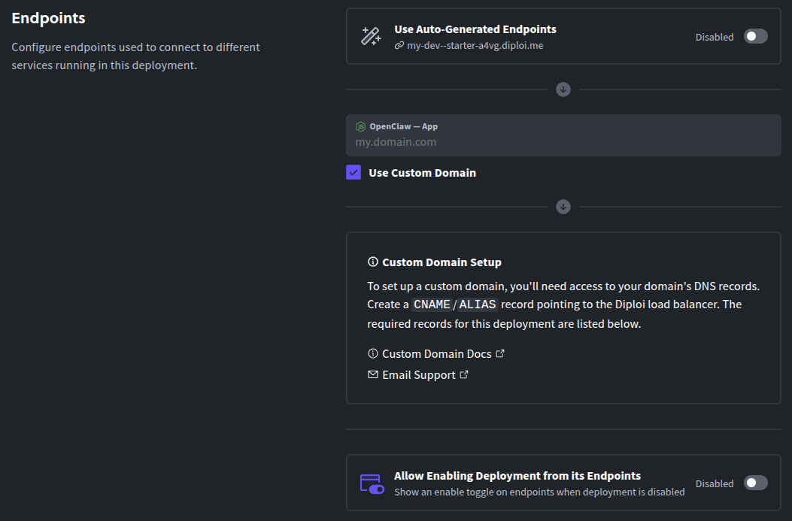
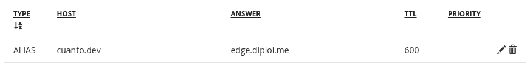

Updated <time datetime="2026-02-19T15:00:00.000Z">February 19, 2026</time>

---

###### Running your own AI assistant without touching any server config

OpenClaw is an open-source, self-hosted gateway that connects multiple apps, with AI coding agents in an easy-to-use interface.

One big issue with OpenClaw is security, which is why it is recommended to run it on a standalone server. Since our mission at Diploi is to make the process of hosting applications as easy as possible, we worked hard to add native support for OpenClaw.

And we did it ☺️

In this guide, we'll deploy OpenClaw on Diploi using our official Starter Kit, and it's all done in less than one minute! Diploi takes care of the environment setup and runtime, so you can focus on your assistant's logic and integrations, while not worrying about the infrastructure.

---

## Table of contents

- [Getting started with OpenClaw on Diploi](#getting-started-with-openclaw-on-diploi)
- [Launching your OpenClaw instance to Production](#launching-your-openclaw-instance-to-production)
- [Configuring a custom domain for your OpenClaw gateway](#configuring-a-custom-domain-for-your-openclaw-gateway)
- [References](#references)

---

## Getting started with OpenClaw on Diploi

### What you need

- A GitHub account
- A Diploi account

You can create a Diploi account for free using your GitHub account, no credit card required to start a trial.

### Launching OpenClaw on Diploi

#### Starting a Trial

To begin with a trial, and no sign-up, just visit our homepage or visit the [OpenClaw Starter Kit page](https://diploi.com/starter-kit/openclaw), and then click **Launch OpenClaw Assistant**.



#### Starting a Project with Version Control

To create a project with a repository, first you need to register for an account. Once you are logged in Diploi, follow these steps:

- **Create a new project:** From the dashboard, click on **Create Project +**.

  

- **Switch to Starter Kits:** From the project creation wizard, switch to **Starter Kits**.

  

- **Select OpenClaw Assistant:** Which bundles the wrapper server and the control UI together, plus it adds a Browser Terminal to the control UI, so you can run advanced commands from your browser.

  

- **Optional, attach additional components and add-ons:** OpenClaw works standalone, but you can add more services to work along, like FastAPI, PostgreSQL, Bun, Next.js, or any other components and add-ons supported on Diploi.

  

- **Create a repository:** Choose **Create Repository** to scaffold a new GitHub repo for your instance.

  

- **Launch the stack:** Click **Launch Stack** and that's it! You will get a development environment with OpenClaw and ready to use 🙂‍↕️

  

Once the environment finishes loading, you'll have access to your OpenClaw control UI. To open the control UI, click on "Open & Login to App" or "View App" at the top of the deployment dashboard.


### Using OpenClaw on Diploi

When you open the Control UI, you will see a welcome page, from which you can access the OpenClaw dashboard, stop or restart the OpenClaw gateway, and access the on-browser terminal.


#### AI Model Fully Setup

All OpenClaw instances hosted on Diploi come with an AI model configured out of the box, so you can start interacting with your agent instantly.


It uses OpenAI's gpt-4.1-nano, through Diploi's custom AI proxy, and you can also add additional models using your own API keys.

#### On-Browser Terminal Access

We added a custom cloud terminal, so you can access the OpenClaw CLI and run commands without having to access the deployment's machine using SSH.


#### Configuring OpenClaw

To access the OpenClaw dashboard, just click "Open OpenClaw Dashboard" from the welcome page. The dashboard is the main point of control for OpenClaw, and it's where you can review the overall state of your agents, manage their skills, and configure additional AI models.


For more information about how to configure your OpenClaw instance, visit their official documentation at https://docs.openclaw.ai/

#### Adding Components and Add-ons

When you host on Diploi, you don't need to manage infrastructure manually, and instead, you alter your project's setup by modifying a single file called `diploi.yaml`, which you can find in the root of your Diploi project.

You can find the necessary snippets to add any of our supported frameworks, languages, and databases directly on our documentation page.

For components, visit https://docs.diploi.com/building/components/ and for add-ons, visit https://docs.diploi.com/building/add-ons



By visiting the link explaining how to add the component or add-on you need, you will find the snippet you need to add to your project.

*Example snippet for FastAPI*

```yaml
components:
 - name: FastAPI
    identifier: fastapi
    package: https://github.com/diploi/component-fastapi#main
```

Now you can copy the snippet and open your `diploi.yaml` file.

*Example diploi.yaml in an OpenClaw Diploi project*

```yaml
diploiVersion: v1.0
components:
 - name: OpenClaw
    identifier: openclaw
    folder: /
    package: https://github.com/diploi/component-nodejs#v24.13.0
    prebuildImage: public.ecr.aws/p8t2q7f4/diploi/starter-openclaw:[tag]
    env:
      include:
 - value: /app/openclaw.json
          name: OPENCLAW_CONFIG_PATH
 - value: /app
          name: OPENCLAW_STATE_DIR
 - value: '{diploi-ai-gateway-url}'
          name: DIPLOI_AI_GATEWAY_URL
 - value: '{diploi-ai-gateway-token}'
          name: DIPLOI_AI_GATEWAY_TOKEN
 - value: '{diploi-ai-gateway-token}'
          name: DIPLOI_AI_GATEWAY_TOKEN
 - value: base64:${generate-random-bytes:32}
          name: DIPLOI_LOGIN_SECRET
 - value: admin
          name: DIPLOI_LOGIN_USERNAME
 - value: password
          name: DIPLOI_LOGIN_PASSWORD
addons: []
```

Now, to add FastAPI, just paste the snippet.

*Snippet added to diploi.yaml*

```yaml
diploiVersion: v1.0
components:
 - name: FastAPI
    identifier: fastapi
    package: https://github.com/diploi/component-fastapi#main
 - name: OpenClaw
    identifier: openclaw
    folder: /
    package: https://github.com/diploi/component-nodejs#v24.13.0
    prebuildImage: public.ecr.aws/p8t2q7f4/diploi/starter-openclaw:[tag]
    env:
      include:
 - value: /app/openclaw.json
          name: OPENCLAW_CONFIG_PATH
 - value: /app
          name: OPENCLAW_STATE_DIR
 - value: '{diploi-ai-gateway-url}'
          name: DIPLOI_AI_GATEWAY_URL
 - value: '{diploi-ai-gateway-token}'
          name: DIPLOI_AI_GATEWAY_TOKEN
 - value: '{diploi-ai-gateway-token}'
          name: DIPLOI_AI_GATEWAY_TOKEN
 - value: base64:${generate-random-bytes:32}
          name: DIPLOI_LOGIN_SECRET
 - value: admin
          name: DIPLOI_LOGIN_USERNAME
 - value: password
          name: DIPLOI_LOGIN_PASSWORD
addons: []
```

And finally, visit the deployment's dashboard to tell Diploi to modify your environment with the newly added component.



### Developing Custom Features for OpenClaw

When you start a new project on Diploi, the first environment you get is a **Remote Development** environment with a public preview URL. You can use it via **Browser IDE** or by accessing remotely with **your local editor via SSH**.


This way, you can customize OpenClaw's config beyond what's possible using the CLI or the dashboard.


---

## Launching your OpenClaw instance to Production

When you're ready to run OpenClaw permanently as your always-on gateway, you need to follow these steps:

- **Push the changes to GitHub.**

- **Open your project dashboard:** Go to your OpenClaw project in the Diploi console and click **Create Deployment +**.

  

- **Configure your new deployment:** First, choose the stage, which in this case will be **Production**, pick a cluster size, and select the source branch.

  

- **Configure environment variables:** By default, Diploi manages a set of secrets for your OpenClaw instance, which you can't edit, but here you can add additional secrets you need.
  
  

- **Finally, click create Deployment** and that's it. Diploi will launch a production build of your OpenClaw project.
  
  

All set! You can open the control UI and start onboarding your first agent, channels, and tools.

---

## Configuring a custom domain for your OpenClaw gateway

By default, your production instance runs on a `.diploi.me` subdomain (e.g., `https://my-dev--starter-a4vg.diploi.me/`). To use your own domain:

- **Open the Options tab:** In your Production deployment, go to **Options**.
  
  

- **Disable auto-generated endpoints** by scrolling to the Endpoints section and clicking on the toggle switch to turn them off.
  
  

- **Add your hostname:** By Enabling the **Use Custom Domain** options and then pasting your own domain.

- **Save the changes**, by scrolling to the bottom of the options page.

- **Edit your Domain DNS recods:** Create a **CNAME** or **Alias** record for your hostname pointing to **edge.diploi.com**.
  
  

The DNS records and SSL certificate spread quickly, but allow up to ~30 minutes for them to work properly. After that, your OpenClaw gateway will be live with your custom domain and with HTTPS handled automatically.

---

And we are set! By now, you've got OpenClaw running on Diploi, starting from a live development environment to production, and with the option to add a custom domain.

If you run into issues or want to share ideas to improve Diploi, please reach out on [Discord](https://discord.com/invite/vvgQxVjC8G) or email us at hello@diploi.com.

Enjoy the claws! 🦞

---

## References

- Official OpenClaw Documentation https://docs.openclaw.ai/
- OpenClaw Starter Kit on Diploi https://diploi.com/starter-kit/openclaw
- OpenClaw GitHub Repository https://github.com/diploi/starter-openclaw
- Custom Domains on Diploi https://docs.diploi.com/deploying/custom-domain/

---