Updated <time datetime="2025-10-28T11:18:05.000Z">October 28, 2025</time>

###### Deploy Supabase in minutes with Diploi, with PostgreSQL preconfigured, and DevOps not required.

Supabase is an open-source alternative to Firebase, which offers an instant Postgres database, authentication, storage, and more. With Diploi, you can get Supabase up and running in a fully-managed cloud environment, with no local setup or manual server configuration.

In this post, we’ll walk through getting started with Supabase on Diploi, deploying it to production, and adding a custom domain.

    <iframe width="560" height="315" src="https://www.youtube.com/embed/kzJp9s_2BHc?si=eApHV7CvPR8BX7Ym" title="Using Diploi to host Supabase instances" frameborder="0" allow="accelerometer; autoplay; clipboard-write; encrypted-media; gyroscope; picture-in-picture; web-share" referrerpolicy="strict-origin-when-cross-origin" allowfullscreen></iframe>

---

## Table of contents

- [Getting started with Supabase on Diploi](#getting-started-with-supabase-on-diploi)
- [Launching your Supabase project to Production](#launching-your-supabase-project-to-production)
- [Configuring a custom domain for your Supabase project](#configuring-a-custom-domain-for-your-supabase-project)
- [Trying out Supabase for the first time?](#trying-out-supabase-for-the-first-time)
- [References](#references)

---

## Getting started with Supabase on Diploi

### What you need

- A GitHub account
- A Diploi account

Signing up in Diploi is free, and does not require credit card.

### How to create a Supabase project

After signing in:

1. Click **Create Project +** in your Dashboard
   

2. Under **Pick Components**, select **Supabase**
   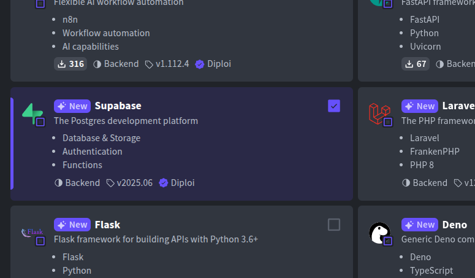

3. Optionally attach any **Add-ons** (like Redis, etc.). PostgreSQL is already included by default
   

4. Under **Repository**, choose **Create Repository** so Diploi scaffolds a GitHub repo for you
   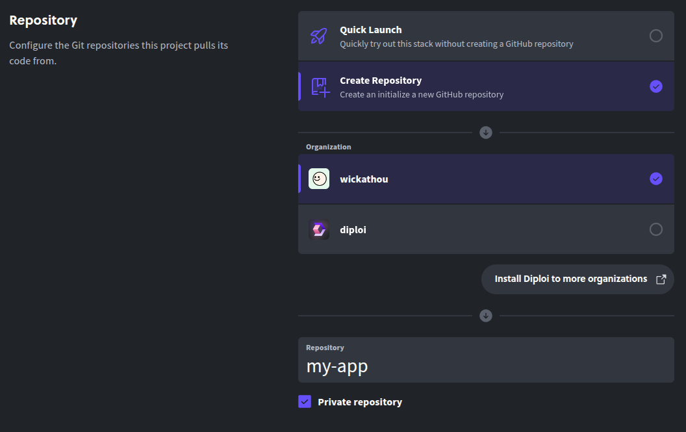

5. Click **Launch Stack** to start your environment
   

This will:

- Scaffold your app with a GitHub repo
- Start a Remote Development environment where you can create custom Supabase Functions
- Launch a live preview URL where you can test Supabase right away
- Allow you to manage ENV variables from the `options` tab

To access the Remote Development environment, you can:

- Use the browser IDE:
  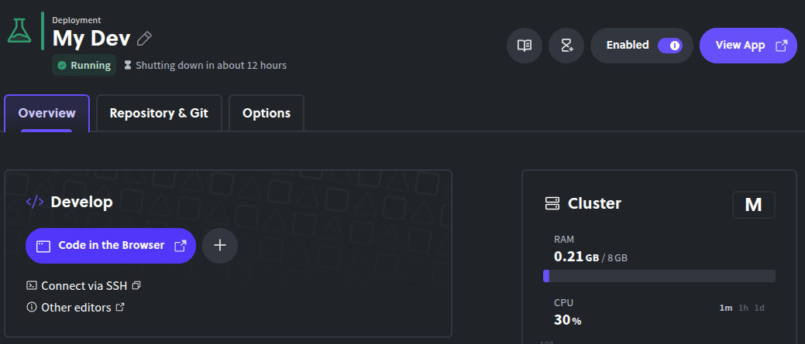

- Or connect via SSH using your local editor:
  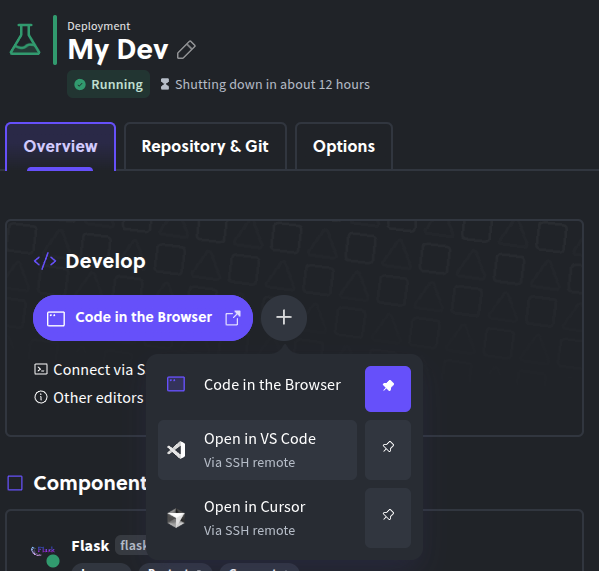

When you access the live version of Supabase, you'll be able to manage your Supabase instance.
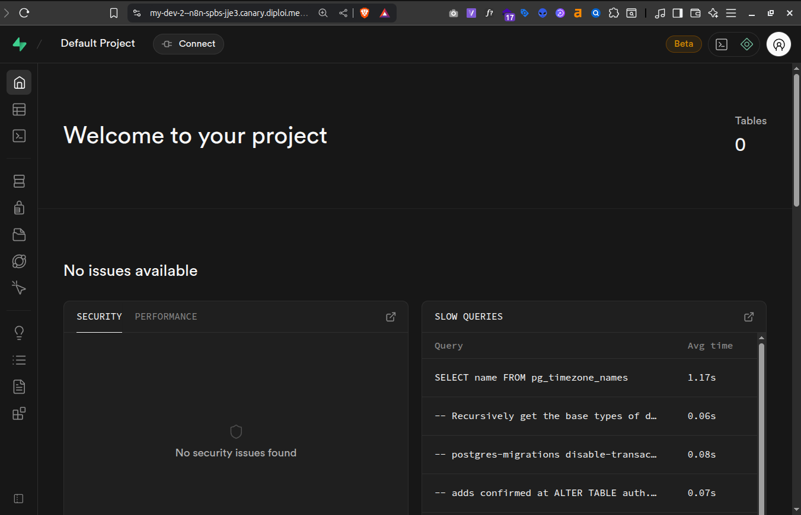

---

## Launching your Supabase project to Production

If you are developing a full-stack app or creating custom Supabase Functions, once you are ready to start using your application in production, all you need to do is this:

1. Push changes to GitHub

2. Open your project dashboard in Diploi
   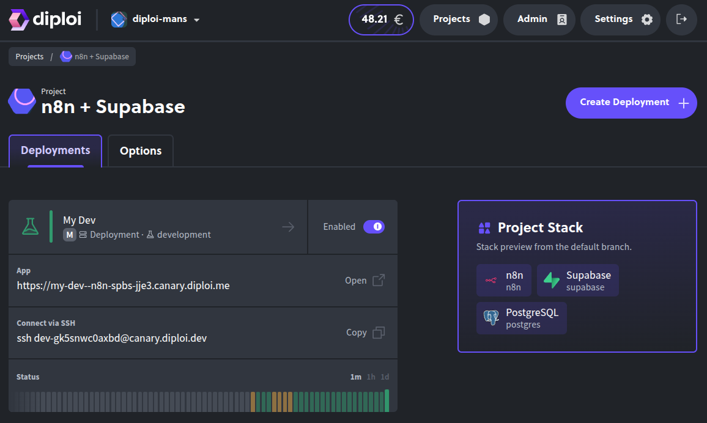

3. Click **Create Deployment +** and select **Production** as the stage
   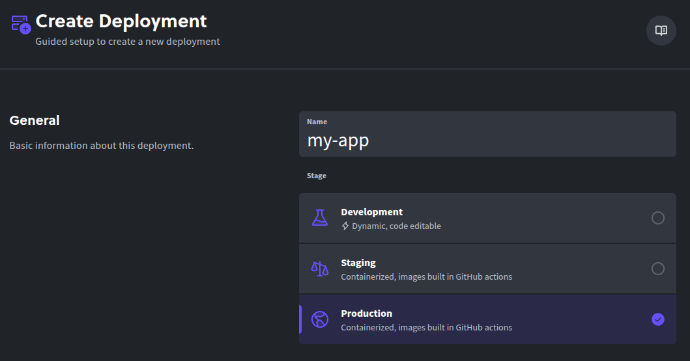

4. Choose a **cluster size**
   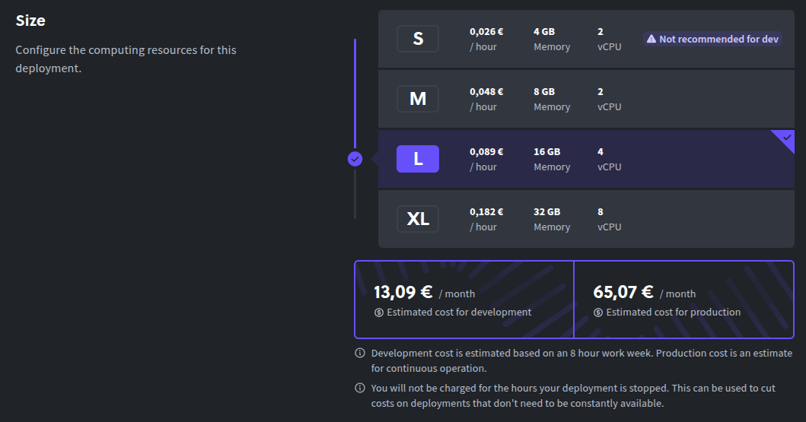

5. Select the **Git branch** that you'll use for production (e.g. `main`)
   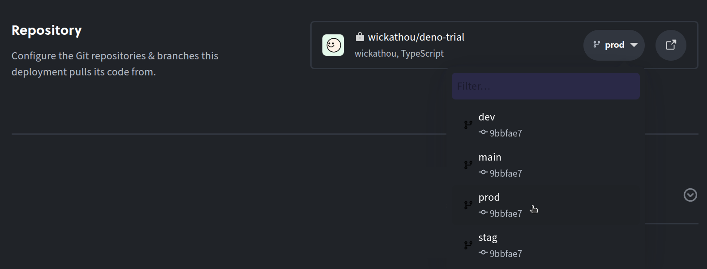

6. Configure any **environment variables** your Supabase app needs
   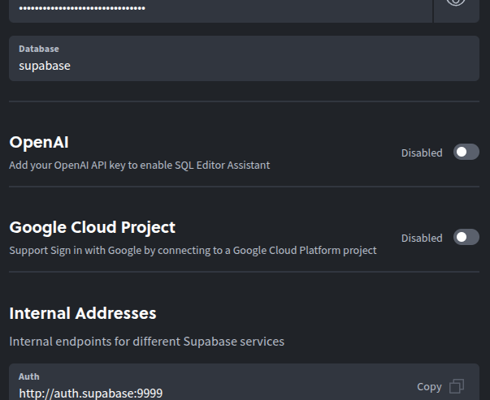

7. Click **Create Deployment**
   

Diploi builds your production instance and gives you a live URL under the `*.diploi.me` domain. Next, let's assign a custom domain for your Supabase deployment.

---

## Configuring a custom domain for your Supabase project

To make your Supabase deployment available under your own domain:

1. Go to your Production deployment’s **Options** tab
   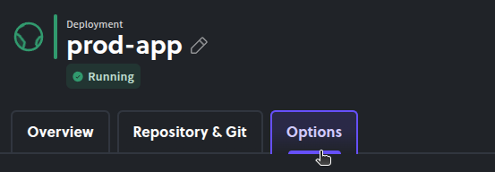

2. Toggle off **Use Auto-Generated Endpoints**

3. Enable **Use Custom Domain** and input your domain (e.g. `db.mydomain.com`)
   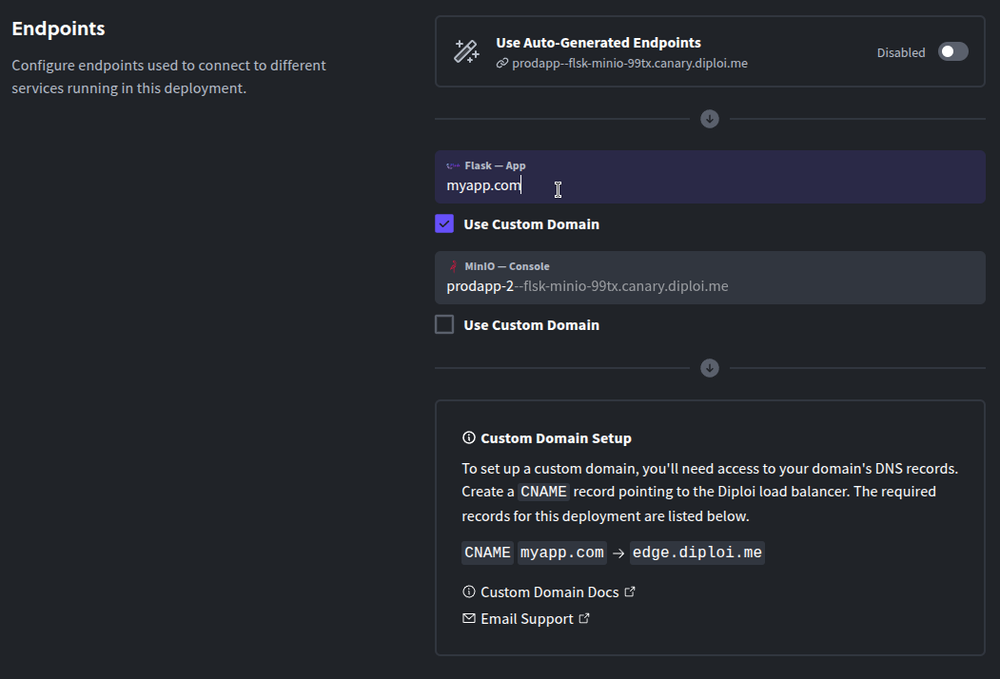

4. Save changes

5. In your domain DNS settings, create a **CNAME** pointing your hostname to `edge.diploi.com`

Diploi handles the SSL certificates automatically. This change usually happens instantly, but sometimes the DNS updates can take up 30 minutes to propagate.

---

## Trying out Supabase for the first time?

No need to commit to anything. You can test Supabase instantly on Diploi:

- **Trial without signing up**
  Visit [https://diploi.com/#StackBuilder](https://diploi.com/#StackBuilder), select Supabase, and click Launch

- **Quick Launch with your Diploi account**
  Create a new project, and in **Repository**, choose **Quick Launch**
  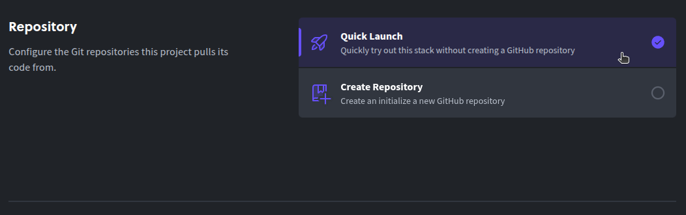

---

## References

- Supabase Docs https://supabase.com/docs
- Diploi Supabase Component https://github.com/diploi/component-supabase
- Launch Supabase on Diploi https://diploi.com/component/supabase
- Diploi Components https://docs.diploi.com/building/components
- Custom Domain Guide: https://docs.diploi.com/deploying/custom-domain/
