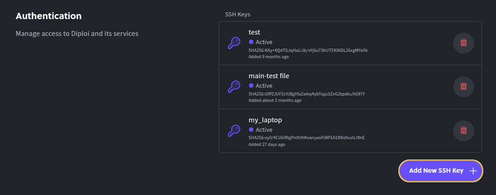
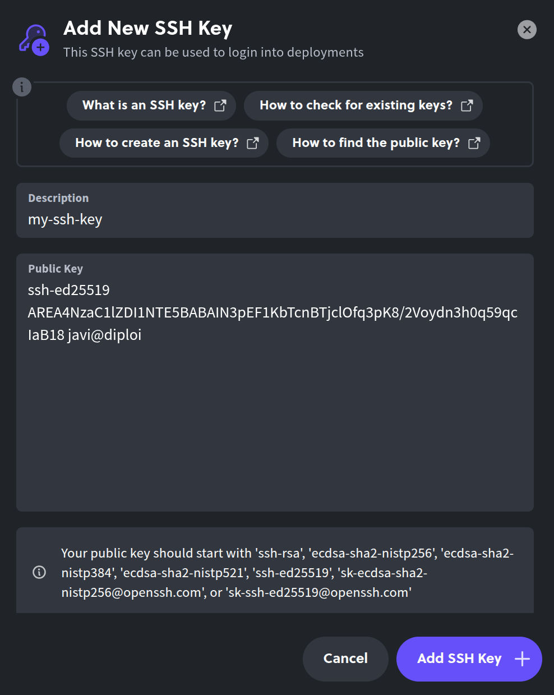
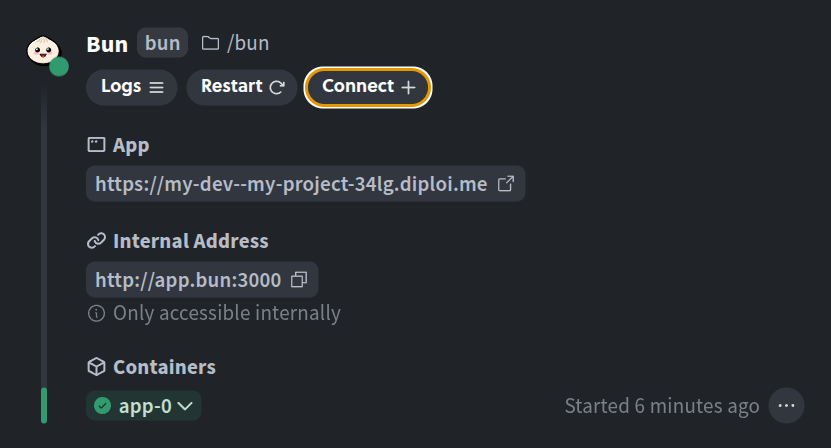

Updated <time datetime="2025-12-04T12:44:00.000Z">December 04, 2025</time>

---

## Table of contents

- [How to generate an SSH key-pair to connect to a server via SSH](#how-to-generate-an-ssh-key-pair-to-connect-to-a-server-via-ssh)
  - [1. Open a terminal and run ssh-keygen](#1-open-a-terminal-and-run-ssh-keygen)
  - [2. Adding the public key to a server or service using SSH for authentication](#2-adding-the-public-key-to-a-server-or-service-using-ssh-for-authentication)
  - [3. Connecting to a service or server using SSH](#3-connecting-to-a-service-or-server-using-ssh)
- [How to install openSSH](#how-to-install-openssh)
  - [In Linux](#in-linux)
  - [In Mac](#in-mac)
  - [In Windows](#in-windows)
- [Wrapping all up](#wrapping-all-up)
- [References](#references)

---

SSH is the preferred way to connect two computers over the network, and to do that, you'll need an SSH key pair. We went over what SSH is in [a different article](/blog/what_is_ssh), so in this article, I'll jump straight to explaining how to generate key pairs.

Let's go!

## How to generate an SSH key-pair to connect to a server via SSH

To generate a set of SSH keys, we are going to use the tool `ssh-keygen`, which is part of `openssh`. For most operating systems, `ssh-keygen` is available by default, but in case you don't have it, you can install it by installing `openssh`, [here we explain how](#how-to-install-openssh).

Using `ssh-keygen` to generate keys should work on any modern OS, so this guide will work on Linux, Mac, and Windows.

### 1. Open a terminal and run ssh-keygen

This is the simplest way to generate a key pair. After opening the terminal, typing `ssh-keygen` and pressing enter, the tool will use a default algorithm for encryption and prompt you to input a location for your new keys.

```
javi@diploi:~$ ssh-keygen
Generating public/private ed25519 key pair.
Enter file in which to save the key (/home/javi/.ssh/id_ed25519):
```

If you don't type anything, the resulting key-pair files will be stored inside of your user's `.ssh` folder as `id_ed25519` for the private key and `id_ed25519.pub` for the public key.

Next, ssh-keygen will ask you for a passphrase to add an extra layer of security to your private key. You might think that adding a passphrase makes your private key file unreadable (or at least I thought that) but that's not what it does, instead, `ssh-keygen` uses the passphrase to encrypt the resulting private key file.

```
Enter passphrase (empty for no passphrase):
Enter the same passphrase again:
```

And that's the last step to generate a key pair, so you'll see the following message in the terminal:

```
Your identification has been saved in my-ssh-key
Your public key has been saved in my-ssh-key.pub
The key fingerprint is:
SHA256:gBVtt/m4zes+/0SZPkd+1wwo javi@diploi
The key's randomart image is:
+--[ED25519 256]--+
|        o..      |
|       o   .     |
|      . .   .    |
|     . o  o.    .|
|      . S .=   o.|
|     o   o= o . B|
|  . o o .o.E  .=*|
|   =.+o+..o +..=o|
|  .+B*=..  . ooo+|
+----[SHA256]-----+
```

Now you have a private and public key files, along with a randomart image ([we'll talk more randomart later](/blog/blog/what_is_ssh_randomart_for)), for we'll only focus on the keys generated.

### 2. Adding the public key to a server or service using SSH for authentication

This step might be somewhat different in terms of how services allow you to add public keys on their platform. For example, on Azure, whenever you create a new VM, Azure creates a private key on your behalf, while others like Upcloud ask you for a public key, just like we did on step 1 using `ssh-keygen`.

For this step, we'll add our newly generated public key **`my-ssh-key.pub`** and add it on **Diploi** (yes, that's us 😊). We are a development and hosting platform, where you can launch full-stack applications, hosted within a Kubernetes cluster, where the frontend, backend, and databases of your app are hosted as containers, and additionally have a development environment built-in within the same cluster, so you can code your app from the browser or using your own IDE.

To access the containers or the development environment, you need to add a public key. That will enable you to access each component that's part of a deployment via SSH or connect to development environments with VS Code, Cursor, Zed, or any other IDE with support for SSH connectivity.

To add a public key in Diploi, you must navigate to "Settings" and then look for the section "Authentication".


Once you find it, you can add a new SSH key by clicking the "Add New SSH Key +" button.



Now you need to copy the contents of your public key file. You can copy the contents of the file by reading the file with the terminal command `cat` or you can open it directly with a text editor.

```
javi@diploi:~$ cat my-ssh-key.pub
ssh-ed25519 AREA4NzaC1lZDI1NTE5BABAIN3pEF1KbTcnBTjclOfq3pK8/2Voydn3h0q59qcIaB18 javi@diploi
```

After you copy the contents of the `.pub` file, paste it into the input field in Diploi.



### 3. Connecting to a service or server using SSH

After adding the public SSH key, you should be able to use SSH to connect to a server. To do so, you need an SSH connection URI, which is usually composed of a user@hostname.

Let's continue with our example using Diploi. I created a Project on Diploi using Bun for an API and React for the frontend, and now I'll try connecting to the container hosting the Bun API.



By clicking on the "Connect +" button, you'll get an SSH connection string, which you can paste directly into your terminal. The copied string will look something like this: `ssh app-3-bun-qkaleob14c5m@console.diploi.com`

```
javi@diploi:~$ ssh app-3-bun-qkaleob14c5m@console.diploi.com
bun@app-3:/app/bun$ 
```

**If you add a passphrase when creating an SSH key pair**, whenever you try to connect to a server, the SSH agent will ask for the passphrase in order to decrypt your private key. To avoid having to input the passphrase every time you start a connection, add your private key to the SSH agent using `ssh-add <path-to-private-key>/<private-key-file>`

```
javi@diploi:~$ ssh-add ./files/my-ssh-key
```
---

## How to install openSSH

In case your machine doesn't have `openssh`, you can installing by searching for the `openssh-client`. For servers, you'll want to use `openssh-server`, which is the package which includes the utilites necessary to be able to host connections from other clients.

### In Linux

All you need to do is to run the terminal command `sudo apt install openssh-client`. Yep, that's all. For more information about it, [check this article from LinuxCapable](https://linuxcapable.com/how-to-install-ssh-on-ubuntu-linux/) .

### In Mac

Most MacOS machines come with openSSH pre-installed by default, but in case it's missing for some reason, you can install it with Homebrew, by opening a terminal and running the command `brew install openssh`. For more info, [check this article from Homebrew Formulae](https://formulae.brew.sh/formula/openssh).

### In Windows

OpenSSH comes as an optional feature which you can activate from Windows Control Panel. Depending on your Windows version, the process is slighly different, but follows a similar formula. In Windows 11, go to *Settings*, then *System*, and then *View features* where you can search by writing `openssh` and you'll see the OpenSSH client listed. For more information about it and explanations for other versions of Windows, [check this article from Windows Club](https://www.thewindowsclub.com/openssh-on-windows-10).

---
## Wrapping all up

You now know how to connect to another computer, server or service using SSH, and in a nutshell, it all boils down to:

1. **Generate** a key pair with `ssh-keygen`.
2. **Copy** the contents of the public key file, eg. `~/.ssh/id_ed25519.pub`.
3. **Paste** it into the target service's SSH settings.
4. **Run** `ssh` to connect to the remote host, eg. `ssh myuser@server.com`.

There are other details we didn't go over here, like encryption algorithms, comments, and key sizes, which might you might need to customize based on the service you want to use and connect to. We added some resources that go over topics related to SSH in the reference section below.

That's all from me, have a great day! ✌

## References

- [Connecting to a remote development environment using SSH](https://code.visualstudio.com/docs/remote/ssh#_remember-hosts-and-advanced-settings)
- [Adding an SSH key to VS Code](https://adamtheautomator.com/add-ssh-key-to-vs-code/)
- [Connecting to GitHub using SSH](https://docs.github.com/en/authentication/connecting-to-github-with-ssh)
- [What is SSH?](/blog/what_is_ssh)
- [What is SSH randomart for?](/blog/what_is_ssh_randomart_for)
