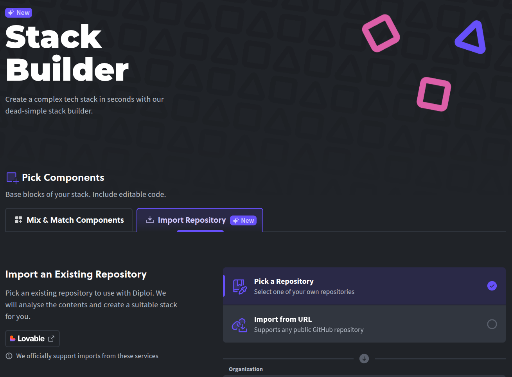
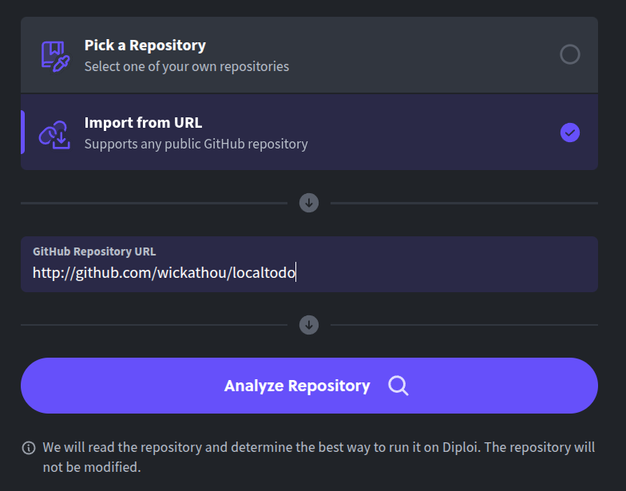
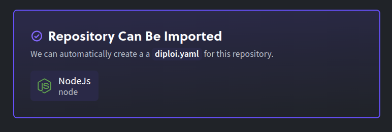
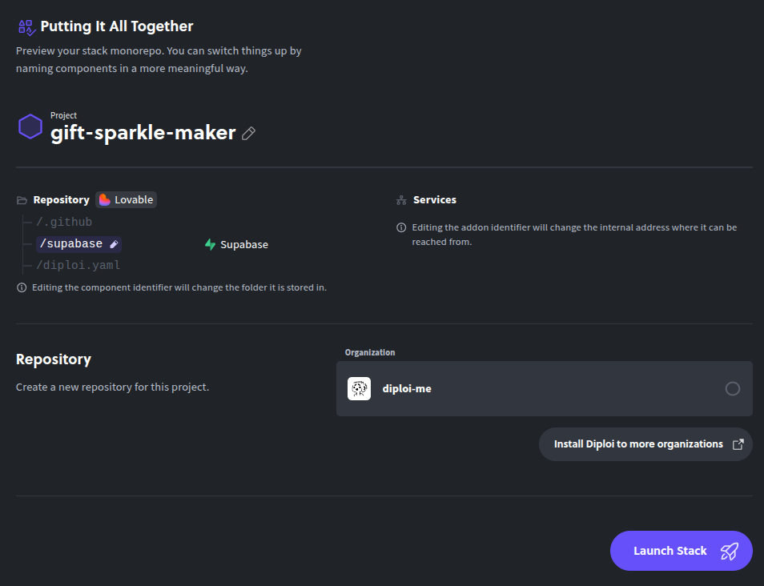
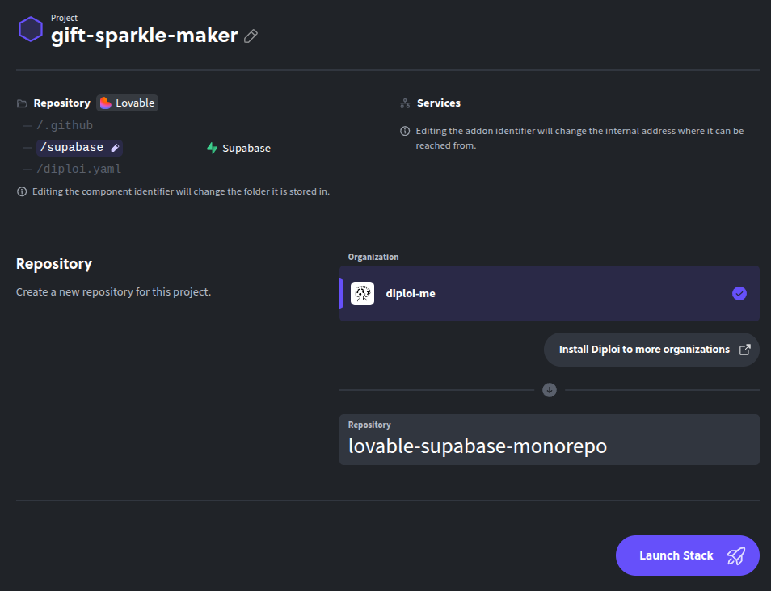
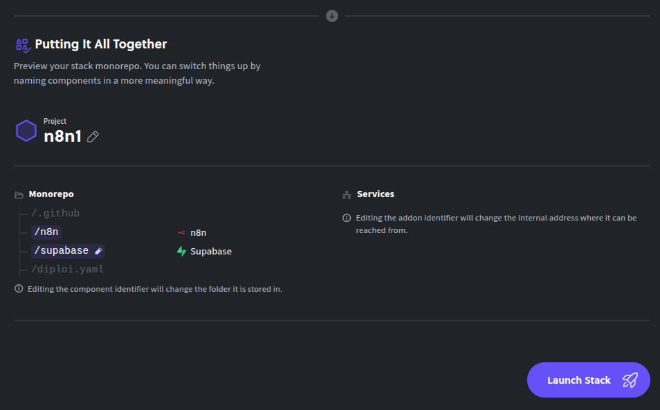
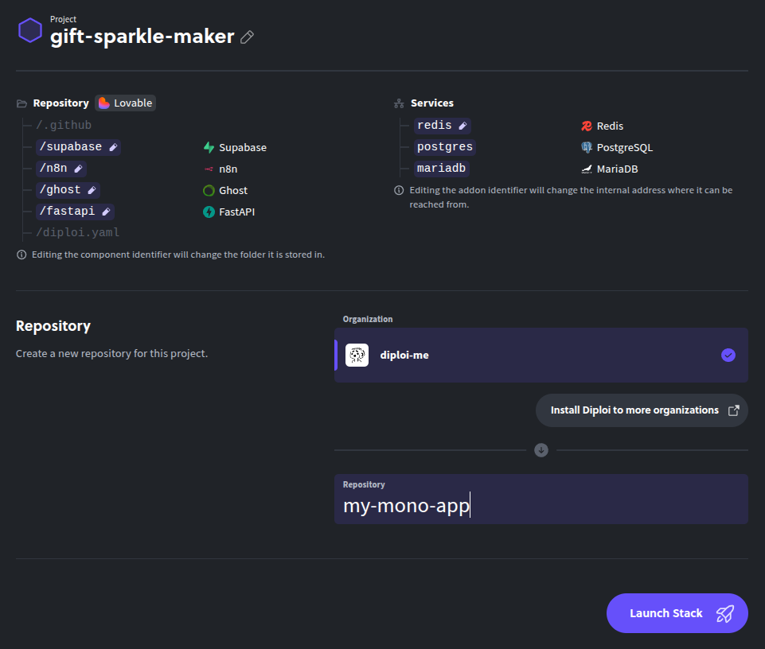
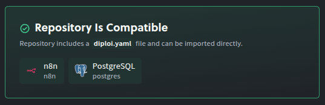
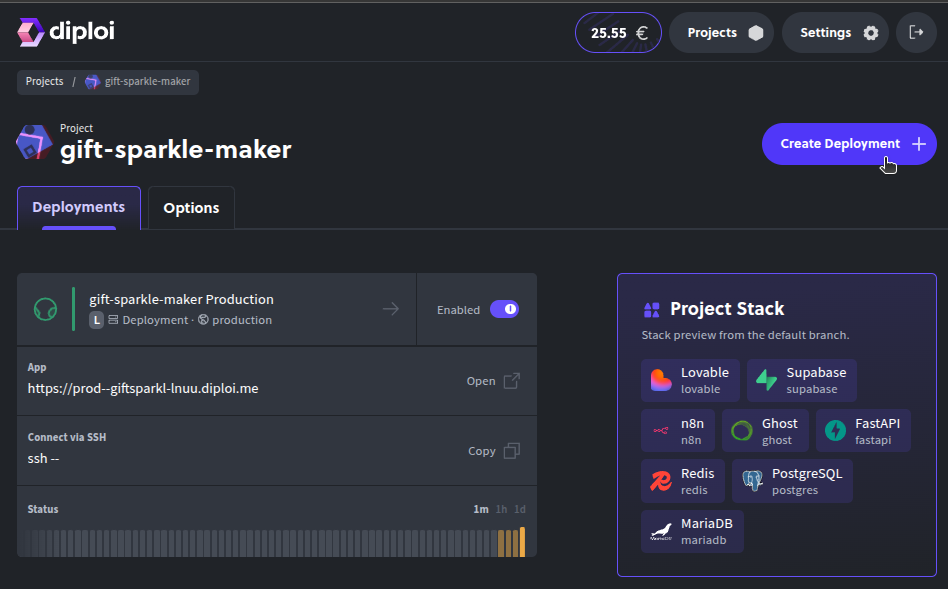
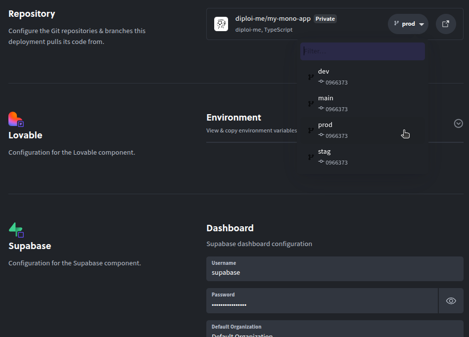

Updated <time datetime="2026-02-19T17:20:00.000Z">February 19, 2026</time>

## Table of contents

- [Import Lovable apps from GitHub Repositories](#import-lovable-apps-from-github-repositories)
  - [Getting started with a Development environment](#getting-started-with-a-development-environment)
    - [Creating a new project](#creating-a-new-project)
    - [Start a New Project with Import Repository](#start-a-new-project-with-import-repository)
    - [Adding Components and Add-ons (for public repositories)](#adding-components-and-add-ons-for-public-repositories)
    - [Starting the imported project](#starting-the-imported-project)
    - [Starting your first deployment](#starting-your-first-deployment)
  - [Creating a Production Deployment](#creating-a-production-deployment)
- [Using a custom domain with imported applications](#using-a-custom-domain-with-imported-applications)
- [Supported frameworks](#supported-frameworks)
- [References](#references)

## Import Lovable apps from GitHub Repositories

We are releasing today the capability to **import apps built using Lovable**, all you need is to import from your GitHub account or if it is a public project in GitHub, you can import it via URL.

But that's not all! We are also releasing in beta, the option to **import any Repository**, although it's not stable yet, you can try it out. We are looking for early adopters to get feedback and improve how imported projects are launched using Diploi and ensure reliability.

If you test these features, please share with us how your experience goes. You can do it via [Discord](https://discord.gg/vvgQxVjC8G) or email us at [hello@diploi.com](mailto:hello@diploi.com).

---

### Getting started with a Development environment

To start importing a Repository, you first need to have:

- A GitHub account, required to register in Diploi.
- A Diploi account.

You can sign up for free at [console.diploi.com](https://console.diploi.com)

#### Creating a new project

Once you are logged in, if it's your first time in Diploi, you'll be welcomed with the project creation wizard.

If it's not your first time in Diploi, you can get started by creating a new project.

#### Start a New Project with Import Repository

By creating a new project, you'll be welcomed by the Stack Builder, where you must select the tab **Import Repository**.

There you'll have two options:

1. Pick a Repository
   Where you can choose a Repository you own, either public or private.
   

2. or Import from URL
   Which allows you to import any public Repository.
   

After you choose an option, all you need to do is click **Analyze Repository**, so our system can review the contents of the Repository to determine the best way to run it.

If you are using a Repository that you own, Diploi will use that same Repository as the base, so you won't be able to add components or add-ons from the Stack Builder in the project creation wizard.

But in case you import a project from a public URL that you don't own, you'll be allowed to add additional components and add-ons to the application you are trying to deploy, and Diploi will create a new Repository with the contents of the public Repository you added.

**IMPORTANT**

> As I mentioned in the beginning, the Import Repository feature has been tested mainly with projects built with Lovable. Of course, we designed it to work with ALL of our supported frameworks and languages, but it is not stable yet, so if you try import other apps, it might wrongly detect how to run it.
>
> If you find issues trying to run an app built with a framework or language supported on Diploi, please let us know!
> [Discord](https://discord.gg/vvgQxVjC8G) | [hello@diploi.com](mailto:hello@diploi.com).

#### Adding Components and Add-ons (for public repositories)

As I mentioned just before, if you import a public Repository that you don't own, you'll be able to add components and add-ons.

For example, a common choice for projects built with Lovable would be to add Supabase.

If you instead choose to import a Repository you own, you won't be able to add custom components or add-ons.

#### Starting the imported project

Now that the stack for our application is ready, we can create a Repository to store the new application.

If instead you are using your own Repository, you won't be prompted to create a new repo.

For the rest of this walkthrough, we'll use a public Repository that we don't own (You can try it yourself by using this URL: `https://github.com/wickathou/gift-sparkle-maker`), to import an application built with Lovable, and we'll add Supabase, Ghost, n8n, FastAPI, and Redis.

You might notice that Postgres and MariaDB were added too, which come bundled by default as they are required by n8n and Ghost, respectively.

**Note**

> For projects created using Diploi, the process is more straightforward, since the system can use the `diploi.yaml` file directly, so the import will be guaranteed to work.
>
> 

Once you are ready, just click **Launch Stack** to start a Development environment.

#### Starting your first deployment

After the import is completed and you launch, Diploi will:

- Set up a **Remote Development** environment
- Scaffold your project structure and Repository
- Install dependencies and build your app

You can get straight to coding your app by using the Remote Development environment in two ways:

- Opening the **browser IDE**, or
  

- Connecting via **SSH** with your local editor (VS Code, Cursor, etc.)
  

Or if you prefer, you can also use `git clone ...` to run your application locally. Diploi generates a Dockerfile for all parts of your application, which you can use to create local images and run your application as containers.

**IMPORTANT**

> Due to safety reasons, Diploi will not push the changes it does to your application, so before you deploy to production, make sure to **push any changes** Diploi made during the setup for your Repository.
> 

---

### Creating a Production Deployment

Once you push the changes to your project made by Diploi, you can create a new deployment for Staging or, more importantly, Production! To do just that, all you need to do is this:

1. Push your development changes to GitHub

2. Open your project dashboard in Diploi.
   

3. Click **Create Deployment +** and select **Production** as the stage.
   

4. Choose a **cluster size**.
   

5. Select the **Git branch** that you'll use for production.
   

6. Configure any **environment variables** your imported app needs.
   

7. Click **Create Deployment**.
   

Diploi provisions your production instance and gives you a live URL on \*.diploi.me. Now let’s point a custom domain to your imported project.

---

## Using a custom domain with imported applications

By default, your production URL is a `.diploi.me` subdomain (for example, `my-imported-app.diploi.me`). To use your own domain:

1. Open the **Options** for the deployment you can point to, for example, your Production deployment.
   

2. Turn off the **auto-generated endpoints**.
   

3. Enable **Use Custom Domain** and enter your hostname, for example, `yourdomain.com`.
   

4. Then update your domain's DNS, by creating a **CNAME** record pointing to `edge.diploi.com`.

DNS and SSL usually finalize quickly, but it can take up to 30 minutes to be ready. After that, your imported application will be live with your custom domain with SSL protection configured automatically.

---

## Supported frameworks

The GitHub import feature has been tested mainly with apps that use Node.js, but mostly apps built with **Lovable**. To give more clarity, divided the level of support that each framework/tooling has when importing an application to Diploi.

- Fully supported: Apps built with these frameworks/tooling will be able to run in Diploi with minimal changes.
- Beta stage: Imported apps might be able to run, but they are not stable or require changes.
- Experimental: Apps might require major changes to their configuration in order to run.

We created this table to explain how well supported each framework is.

| Framework / Tooling | Support Level   | Recommended for Production |
| ------------------- | --------------- | -------------------------- |
| Diploi              | Fully supported | ✅                         |
| Lovable             | Fully supported | ✅                         |
| React-Vite          | Fully supported | ✅                         |
| Node.js             | Fully supported | ✅                         |
| Astro               | Beta stage      | ❌                         |
| Deno                | Beta stage      | ❌                         |
| Bun                 | Beta stage      | ❌                         |
| Hono                | Beta stage      | ❌                         |
| Next.js             | Beta stage      | ❌                         |
| Nue                 | Beta stage      | ❌                         |
| FastAPI             | Experimental    | ❌                         |
| Flask               | Experimental    | ❌                         |
| Django              | Experimental    | ❌                         |
| Supabase            | Experimental    | ❌                         |
| n8n                 | Experimental    | ❌                         |
| Ghost               | Experimental    | ❌                         |
| Laravel             | Experimental    | ❌                         |
| SvelteKit           | Experimental    | ❌                         |

If you try importing a project with your preferred framework, we would love to know how your experience was and what we should improve or fix, so please let us know!

---

## Got Feedback or Issues?

The Import Repository is still in beta overall, and your feedback helps us improve.

If you have questions or encounter problems:

- Join our [Discord community](https://discord.gg/vvgQxVjC8G)
- Or email us directly at **[hello@diploi.com](mailto:hello@diploi.com)**

Give it a spin with your favorite project. 🙂‍↕️ [Try Import from GitHub today](https://console.diploi.com/)

Happy deploying!

---

## References

- Diploi Components https://docs.diploi.com/
- Custom Domains https://docs.diploi.com/deploying/custom-domain/
