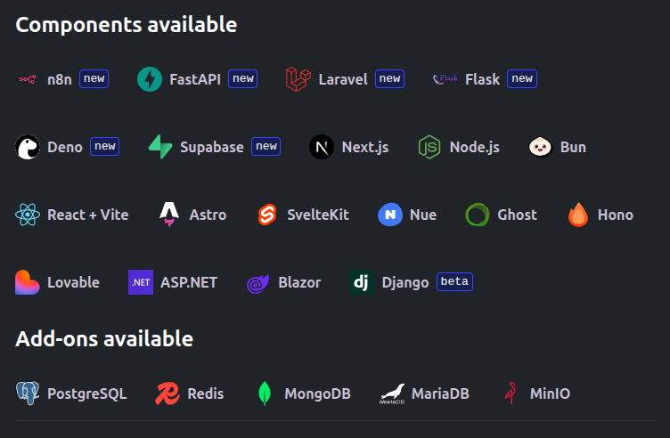

Updated <time datetime="2026-02-19T17:30:00.000Z">February 19, 2026</time>

***

As the year comes to a close, 2025 has been intense! So we took some time to look back at what happened.

This is us, the people behind Diploi! From left to right, Giao, Patrik, Marcus, Javier, and Tuomas.

Nice to meet you!

## What happened in 2025, a quick recap

Diploi started in 2024, when the team was [only 3 people](/blog/hi-from-diploi-52j9), composed by [Tuomas](https://www.linkedin.com/in/munkkeli/), [Patrik](https://www.linkedin.com/in/patriklindberg/), [Marcus](https://www.linkedin.com/in/marcusahlfors/), focused on building a product that would help developers use their time to do more of the actual fun coding, and less of the boring and repetitive config work. And they were successful on that!

So when 2025 came around, the product reached a stage where it was ready for actual users, so the need of actively promoting the product to developers grew, which is why Javier ([I'm the one writing](https://www.linkedin.com/in/javierjhm/)) joined the team in February.

By August, Diploi became a bit too complex for only 2 people to work on features and fix bugs, so the team started to look for a talented developer to keep growing the product, and after a short search, [Giao](https://www.linkedin.com/in/giao-ngo/) joined the team! Her onboarding was sooo quick that just in her first week, she was already pushing a massive pull request, with new features and bug fixes. It was like she learned the entire product by day two!

With our team now being 5 people, constantly working on new features, improvements, and fixes, we have built an amazing team dynamic, and we are constantly pushing for more!

Moving forward to now, at the beginning of December, we reached the mark of getting 1000 registered users! We released a long list of features that put us in a premium spot to start 2026, and go even bigger! Just to list a few of the most notable improvements in Diploi, we have:

- Support for Python, PHP, C#, and .NET
- Added Ghost, Supabase, and n8n, to build even more complex applications on Diploi
- Launched MinIO as a file storage system and MariaDB for SQL-based backends
- New ready-to-use LLM support with Claude, and ChatGPT Codex, to vibe-code within the browser IDE instantly
- Implemented a way to import existing applications from Lovable, Next.js, React, and Node.js applications

So yes, a lot happened, but one thing we didn't have a chance to do was launch a proper press release about Diploi and our mission.

Until now. 😎

[Click here to check our press release](/blog/our_first_press_release).

***

If you would like to talk with us, feel free to reach out via email at hello@diploi.com or message us on Discord, using this link [discord.com/invite/vvgQxVjC8G](https://discord.com/invite/vvgQxVjC8G)

***

## Closing thoughts

It took a lot of effort to get here, and it almost feels like the year happened within a month... But it was worth it!

As we look forward to 2026, we hope you have enjoyed this journey as much as we have

And from everyone in Diploi, we wish you a happy New Year! 🎆
