Updated <time datetime="2025-10-28T11:22:05.000Z">October 28, 2025</time>

---

## Table of contents

- [How to expand Lovable apps with Cursor and flexible hosting](#how-to-expand-lovable-apps-with-cursor-and-flexible-hosting)
- [What is possible with Diploi](#what-is-possible-with-diploi)
- [Importing a Lovable app to Diploi](#importing-a-lovable-app-to-diploi)
  - [Getting started with a Development environment](#getting-started-with-a-development-environment)
  - [How to connect Cursor to your Lovable app](#how-to-connect-cursor-to-your-lovable-app)
- [Creating a Production deployment for your Lovable app](#creating-a-production-deployment-for-your-lovable-app)
- [Adding a custom domain to your deployed Lovable app](#adding-a-custom-domain-to-your-deployed-lovable-app)
- [Expanding your Lovable app with Components and Add-ons](#expanding-your-lovable-app-with-components-and-add-ons)
- [Bringing It All Together](#bringing-it-all-together)
- [References](#references)

---

## How to expand Lovable apps with Cursor and flexible hosting

<div style="display:flex; justify-content:center; width:100%">
    <iframe width="560" height="315" src="https://www.youtube.com/embed/YqYhgBOR6_Q?si=LkyQvckMo7p8RCp8" title="Lovable deployment tutorial" frameborder="0" allow="accelerometer; autoplay; clipboard-write; encrypted-media; gyroscope; picture-in-picture; web-share" referrerpolicy="strict-origin-when-cross-origin" allowfullscreen></iframe>
</div>

When you create a new application with Lovable, you get a lot done for you with just one prompt, which is great to get your project going, but! If you are here, it is because you also noticed that this is not enough.

Maybe you reached the limits of what's possible with Lovable, got tired of context pollution, or limited branching support when deploying your app.

Lovable's context can get polluted, and after a few chats, you end up either spending credits to fix bugs that the AI has introduced as it goes or looking for ways to restore your app to a point when it was working.

Other times, you might want to use tools like Cursor, so you can target specific areas of your codebase and work along with Cursor's AI to improve your product, but since Lovable has it's own cloud and environment settings, you might cause unnintended issues, when your app is not able to run on Lovable and you need to find an alternative to host it.

Because of these issues, we decided to create something to help people who use Lovable extensively by adding a way to import apps built with Lovable on Diploi. As a developer platform, with Diploi, we give you a way to host and code without the usual work of running apps locally or setting up servers.

## What is possible with Diploi

Not only can you import your apps or start from zero, but you can also expand what's possible for your apps by using Diploi, where you can:

- add a backend for your imported apps,
- migrate from paid Supabase to open-source Supabase,
- add additional databases,
- add blogging with Ghost,
- and add automated tasks with n8n,

The best part is that you can host all of these services along your Lovable app, within the same server cluster, so you only pay for one service, rather than paying for multiple servers to host each part of your full-stack application.

You get a smooth hosting experience, where you can add custom domains, and the option to deploy preview or production environments for your app without having to set up CI/CD pipelines or SSL certificates.

You can add components and add-ons in Diploi just by modifying a [diploi.yaml](https://docs.diploi.com/reference/diploi-yaml) file, which is created when you import an app from Lovable.

So let's go over a walkthrough.
In this blog, we'll show you how to import an application created using Lovable. Let's get going 👨‍🏭

---

## Importing a Lovable app to Diploi

In this walkthrough, we'll be importing an application stored on GitHub and built with Lovable. The app has a soundboard interface where you can play sounds and it allows you to add new sounds to the list available.


If you want to use this same application for testing, here's the public repository which you can use to import the app to your own Diploi account: https://github.com/wickathou/vibe-tune-podcast

You can see the live app here: https://demo--soundboarded.diploi.me/

Let's get started by creating a new project and starting a Development environment, where you can start coding with Cursor right away.

---

### Getting started with a Development environment

We'll assume that you already have a GitHub account and at least one project built with Lovable (you can use the repository we used for this guide too).

#### 1. Create a Diploi Account

Now you'll need to create an account in Diploi, which is free. You can do it from [console.diploi.com](https://console.diploi.com).

#### 2. Create a new project

Once you finish creating an account, you will be welcomed with the Stack Builder, which is the place to create a new application from zero or import a repository from GitHub.

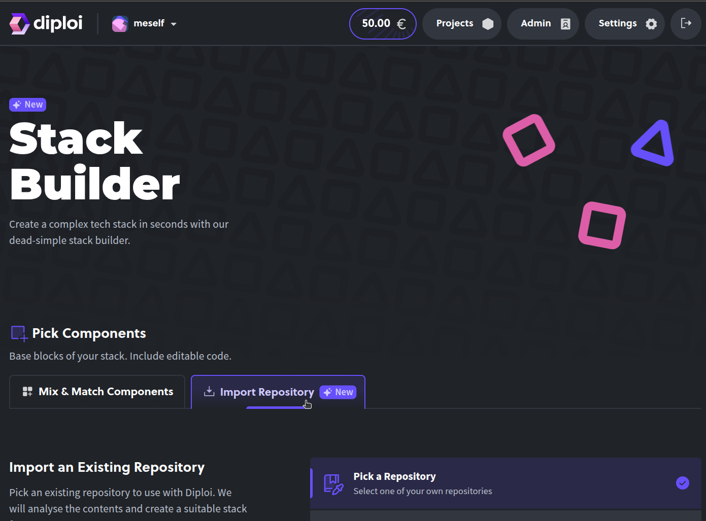

#### 3. Select the repository you want to import

From the Stack Builder, choose the option **Import Repository** and you have the option to:

- Select the application you want to import from your list of repositories.
  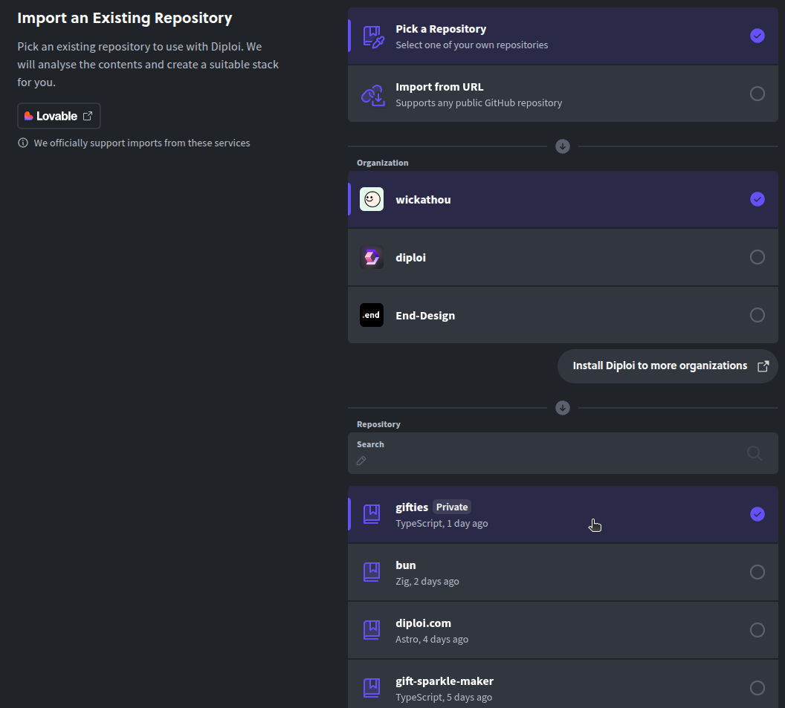

- Importing from a URL, which allows you to use the URL from any repository you own or public repositories, even if you are not the owner.
  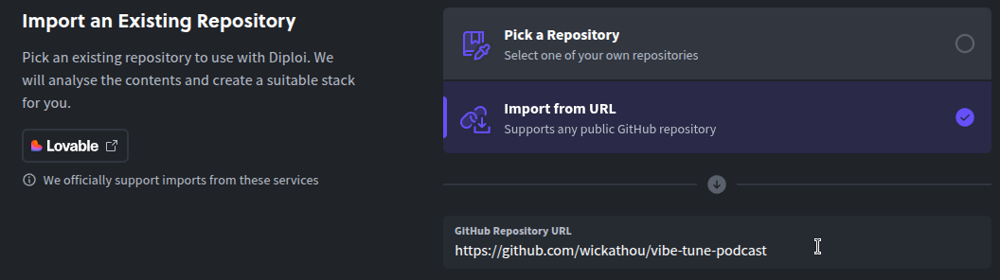

#### 4. Analyze the repository

To make sure that the repository will be able to run on Diploi, you must click **"Analyze repository"** so Diploi can check the configuration of your project and prepare your deployment environment.

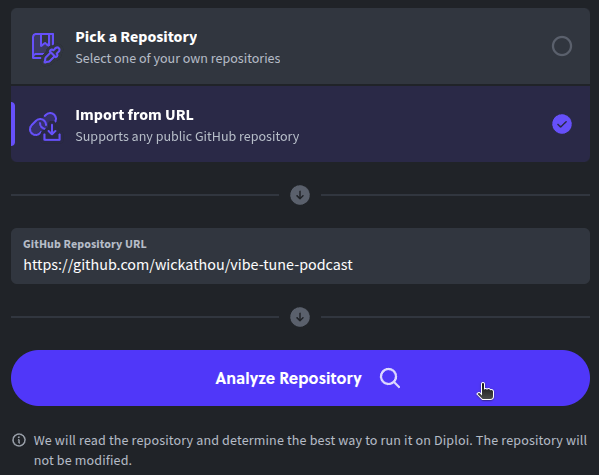

If the analysis is successful, you will get a notification indicating that your repository contains a Lovable application.

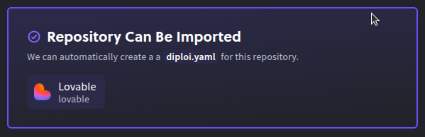

#### 5. Launching the application

Something we must note is that depending on the ownership of the repository, the steps after the repository has been analyzed are different.

##### If you are the owner of the imported repository

You can just launch your application instantly, without having to configure additional settings for your deployment. Any updates you made to the code will be linked to the repository you imported.

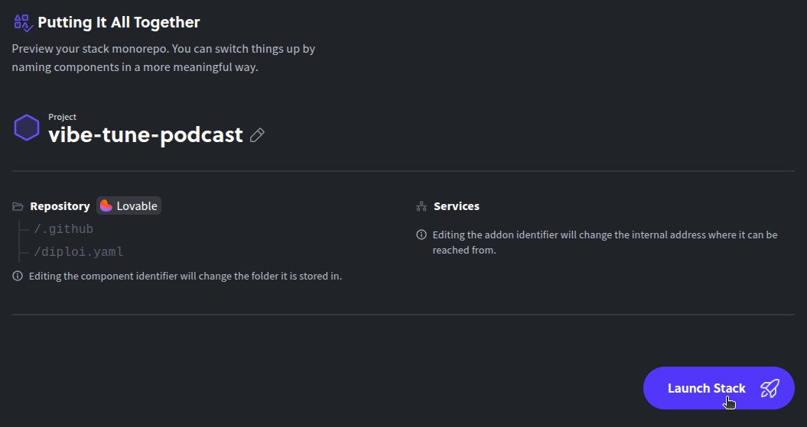

##### If you are importing a repository from someone else

You can customize the stack for your imported Lovable app, so you can add other services like [Bun](https://diploi.com/component/bun) to create a backend for your app or [Ghost](https://diploi.com/component/ghost) to add a blog.

Diploi allows you to create a new repository for your application, since you don't own the imported repository.

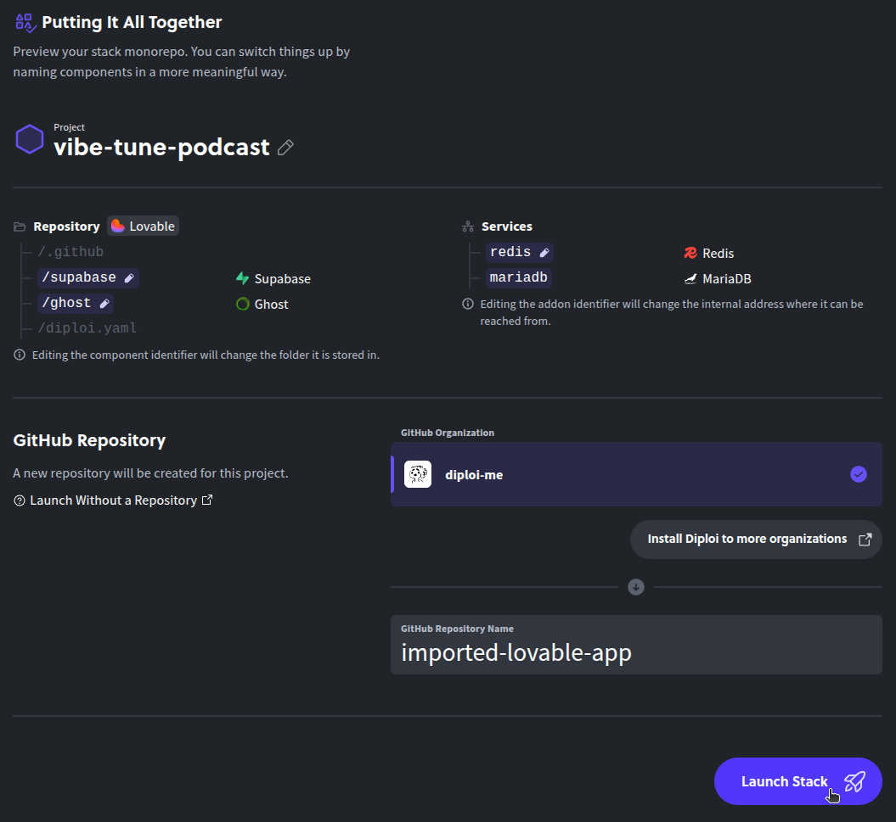

---

At this stage your app should be ready to be launched, so all you need to do is click **"Launch Stack"** and a new Development environment will be created for you.


---

### How to connect Cursor to your Lovable app

Now your application should be running, and you should see something like this:

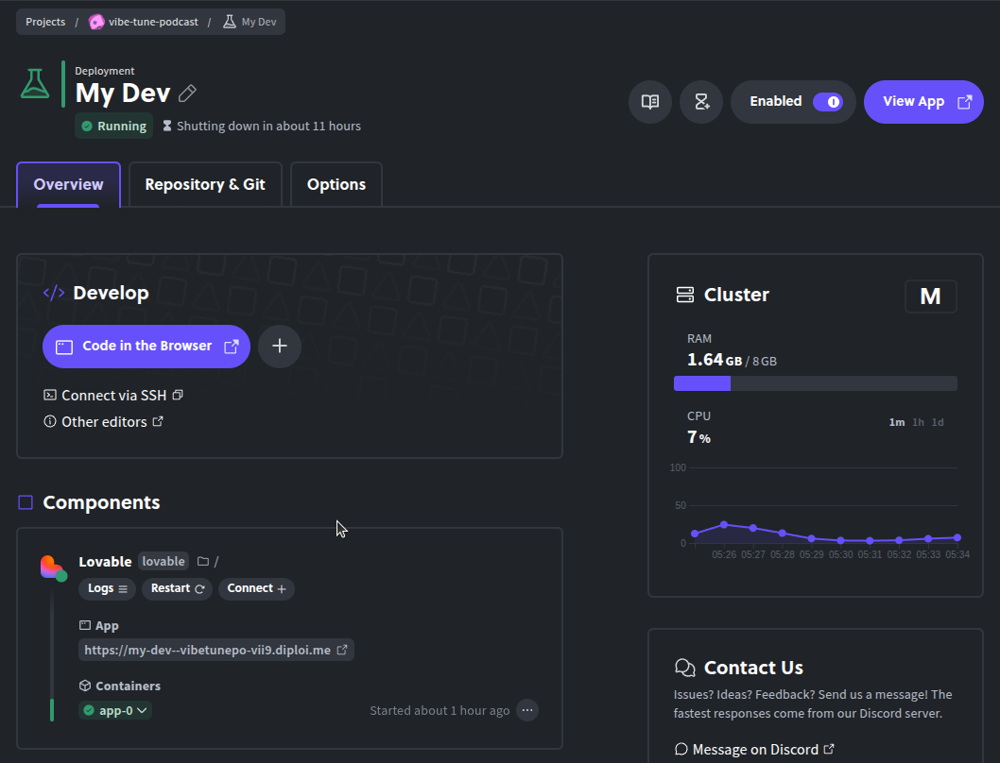

From here you can preview the application live, by clicking on **"View App"**.

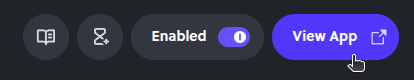

And you can also access the Remote Development environment where you can start coding your application, that allows you to start coding without installing anything.

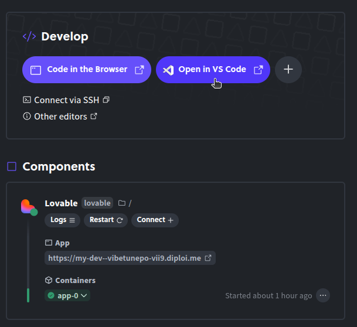

Now, we want to connect Cursor, so we need first to add an SSH key to connect your computer to the Remote Development environment. Here's what you need to do.

#### 1. Create an SSH key

There are multiple ways to generate an SSH key, but in my opinion the easiest way to do it is by using the command `ssh-keygen` from whatever Terminal application you have available in your computer. The steps you must follow are:

1. Open a Terminal
   - in **Linux**, you can open the terminal by pressing `Ctrl`+`Alt`+`T`
     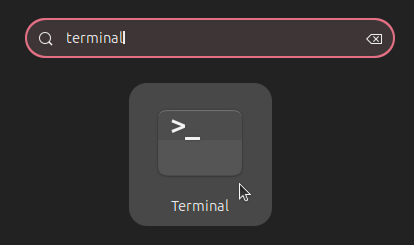
   - in **Mac**, open the Spotlight Search by pressing `Command`+`Space` and then typing "terminal".
     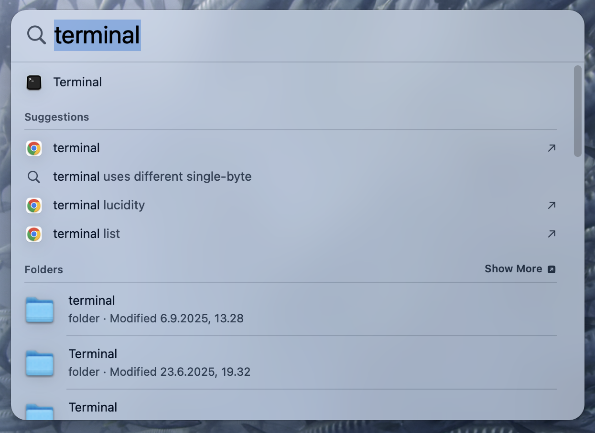
   - in **Windows**, you can open the terminal by opening Git Bash from your apps (If you don't have it, you can download it here https://git-scm.com/downloads)

2. Then type the command `ssh-keygen`, which will generate an SSH key, which by default will have the name `id_ed25519`, but you can assign a different name and store it on a different folder. For convenience, use the default filename and location, since Cursor by default will use the same filename and location to fetch your SSH keys.

3. After the filename has been assigned, you will have the option to assign a passphrase to use your SSH key. You can leave it empty by just pressing enter.

#### 2. Add the SSH Public Key in Diploi

By now, `ssh-keygen` would have generated 2 files. If you used the default name, the filenames would be `id_ed25519`, which stores your Private Key and ``id_ed25519.pub`, which stores your Public Key.

The next steps are to copy your Public Key, which you can do by reading and copying the contents from `id_ed25519.pub`, and pasting them in your Diploi account settings.

1. To copy the contents of your Public Keyu file, you can use any text editor to open and copy the contents of the file, or from the terminal, you can use the command **cat**, so if you used the default name and location, the command would look like this: `cat ~/.ssh/id_ed25519.pub`, and after pressing enter you should see in the terminal something like this:
   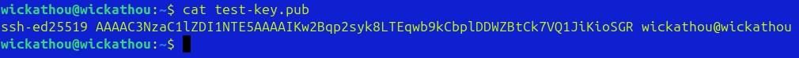
   From there, you can just select the text starting from "ssh-ed25519..." and then press `Ctrl`+`Shift`+`C`

2. Now you need to add the copied text in Diploi, which you can do from the settings page at `https://console.diploi.com/<YOUR_USERNAME>/settings`, scroll down to the **"authentication"** section, and then click on **"Add New SSH Key"**.
   

3. And the last step is to paste the contents we copied before inside the **"Public Key"** text field, and then press **"Add SSH Key"**.
   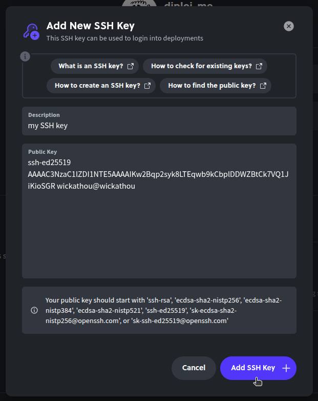

Now we are ready to open the imported Lovable app with Cursor.

#### 3. Opening your app with Cursor

Now we are ready to open the imported app from Lovable using Cursor.

1. Go to the deployment page and enable Cursor, from the **"Develop"** section, press the button **+** and you'll be able to see the **"Open in Cursor"** option.
   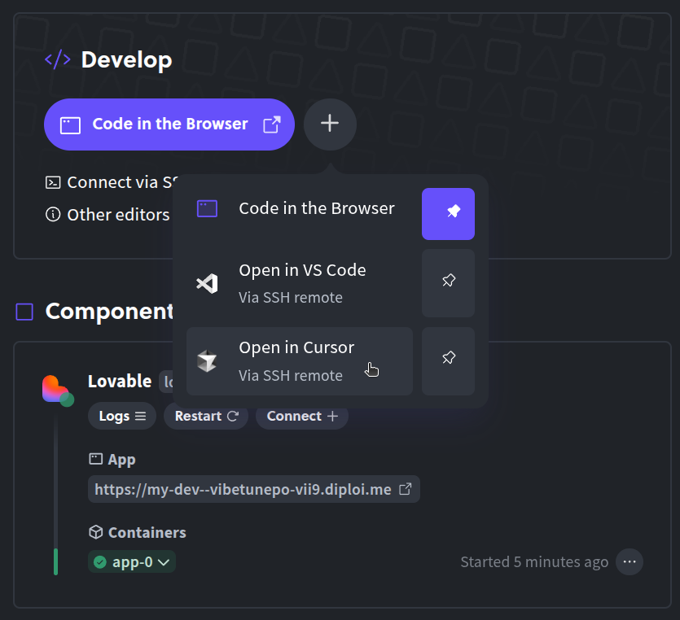
2. To pin the **"Open in Cursor"** button to your deployment, just click on the pin icon next to the text.
   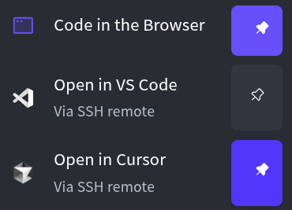

3. When you click on the button to open Cursor, the app will use SSH to connect to the development environment.
   

---

And that's it! Now you can connect Cursor to any other app you import or create in Diploi.

---

## Creating a Production deployment for your Lovable app

Once you get your application to a stage where it is ready to be launched in Production, you can create a new deployment that will be used for that specific case. Before getting started, you must first push your updates to GitHub, so your application has your changes plus the files that Diploi added to your repository in order to be able to run your application.


If you don't push files that Diploi creates for your repository, then your Production deployment will fail to start.

#### 1. Create a new deployment

Go to the project page, and click on the button **"Create Deployment"**.


#### 2. Select the stage for the new deployment

On the deployment creation page, select the stage for the deployment as **"Production"**. You can also choose "Staging" if you want to generate a deployment intended for testing.

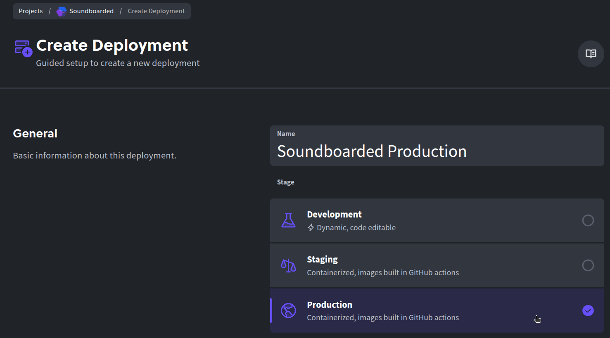

#### 3. Choose the size for the cluster

You can choose between 4 cluster specs, and in general we recommend you start with **S** size clusters when launching Lovable apps to Production, since you can always resize the cluster later if your application starts getting a lot of traffic.


#### 4. Select the branch you will deploy to Production

If you have your production version for your app on a different branch than main, here you can select it for your new Production deployment.


#### 5. Configure the environment variables for Production

If your Lovable app uses environment variables, in this section you can add them.


---

And that should be all you need to set up your new **"Production"** deployment, just click **Create Deployment** and you'll have a Production environment live.


---

## Adding a custom domain to your deployed Lovable app

Now that your app is in Production, you probably want to use a custom domain too. Let's walk through over the steps you need to follow.

#### 1. Open the Options tab from the Production deployment dashboard


#### 2. Turn off auto-generated endpoints


#### 3. Enable "Use Custom Domain" and enter your hostname

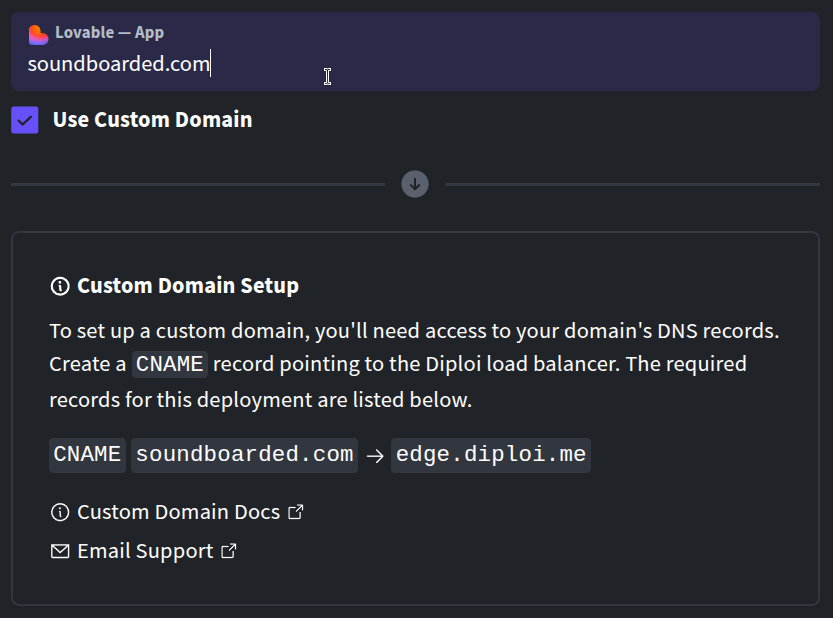

#### 4. Create a CNAME record from your domain's DNS settings, pointing to `edge.diploi.com`

---

It is common for the custom domain to be fully set up within 1 to 2 minutes, but it can take up to 30 minutes for the update to propagate and for your website to be reachable and SSL-protected.

---

## Expanding your Lovable app with Components and Add-ons

If you want to elevate your application with a proper Backend, blogging, or databases, you can add components like **FastAPI**, **Ghost**, **n8n**, etc., and add-ons like **Redis** and **Supabase**.

#### 1. Open the diploi.yaml file

To add them, all you need to do is access your app's folder and find the `diploi.yaml` file. When you open it, the content for your Lovable app would look like this:

```yaml
diploiVersion: v1.0
components:
  - name: Lovable
    identifier: lovable
    folder: /
    package: https://github.com/diploi/component-lovable#v1
addons: []
```

The `diploi.yaml` tells Diploi how to build your app's environment. Each component and addon defined for your app has a name, identifier, and a package URL pointing to the Diploi component repository.

#### 2. Add new components and addons to your Lovable add

To add a new component for your app's stack, all you need to do is add a new entry to the components or addons list with all of the properties required to define them. For example, let's say we want to add **FastAPI**, **Postgres**, and **Redis**, your `diploi.yaml` would then look like this:

```yaml
diploiVersion: v1.0
components:
  - name: Lovable
    identifier: lovable
    folder: /
    package: https://github.com/diploi/component-lovable#v1
  - name: FastAPI
    identifier: fastapi
    package: https://github.com/diploi/component-fastapi#main
addons:
  - name: Redis
    identifier: redis
    package: https://github.com/diploi/addon-redis#main
  - name: Postgres
    identifier: postgres
    package: https://github.com/diploi/addon-postgres#main
```

After modifying the `diploi.yaml` file, if you go back to your deployment's dashboard, you'll see a notice listing the pending changes for your environment.

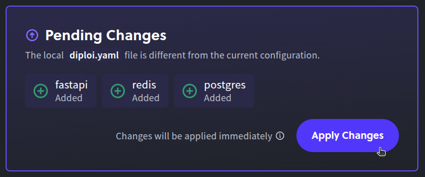

By clicking **"Apply Changes"**, Diploi will proceed to start additional containers to host the new component and addons as pods in the same cluster that already hosts your Lovable app.

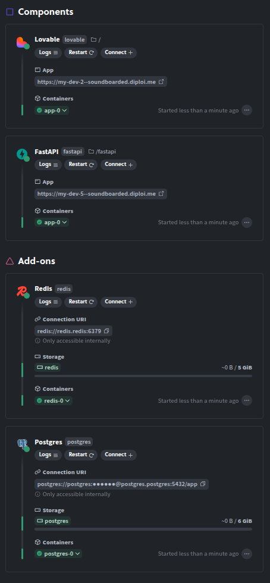

---

## Bringing It All Together

In summary, importing a Lovable app into Diploi would allow you to elevate what your apps can do and how you can host them, without having to do manual work setting up servers or configuring anything manually.

For more details about the `diploi.yaml` syntax and available components/add-ons, check the Diploi docs.

https://docs.diploi.com

By importing your Lovable app into Diploi, you effectively upgrade it from a frontend prototype into a full-stack, production-ready app, without leaving the Diploi console. You get one-click deployments, remote dev environments, and pay-as-you-go hosting all in one place.

And the best part is that you can still continue using the Lovable AI chat for your frontend, because the changes that Diploi makes on your repository's folder structure and the files added do not conflict with Lovable's system.

---

If you are building something using Lovable and Diploi, please let us know!

You can connect with us directly on Discord or via email. We'll be happy to talk with you and help however we can.

Until the next one! 😎

---

## References

- Diploi Components https://docs.diploi.com/building/components
- Diploi Addons https://docs.diploi.com/building/add-ons
- Custom Domains https://docs.diploi.com/deploying/custom-domain/
- Adding an SSH key in Diploi https://docs.diploi.com/building/add-ssh-key
